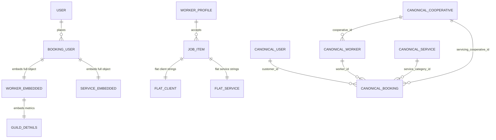

# Cross-Application Data & Entity Audit Report: Worker vs User Frontend

**Audit Target Workspaces:**
1. `/worker-frontend` (`c:\Users\Surya Dev Kamboj\OneDrive\Desktop\worker-frontend`)
2. `/user-frontend` (`c:\Users\Surya Dev Kamboj\OneDrive\Desktop\user-frontend`)

**Audit Type:** Read-Only Cross-Application Entity, Field, Relationship, and Schema Mismatch Audit  
**Date of Audit:** September 10, 2026  
**Project Ecosystem:** KAIROVA / GigSevak / GharSaathi (NCCT Smart India Hackathon Ecosystem)

---

## Executive Summary

This audit evaluates the data structures, entities, field naming conventions, relationship models, and API expectations between the worker-facing application (`worker-frontend`) and the customer-facing application (`user-frontend`). 

While both frontends were developed to serve the same overarching cooperative gig-platform ecosystem, they were developed independently with distinct abstractions, data shapes, state conventions, and mock registries. This report provides a comprehensive, field-by-field audit of all worker-related data across both applications to guide the design of a canonical backend schema.

---

## 1. Worker-related entities in worker-frontend

The `worker-frontend` application (package: `sih26-gharsaathi-worker` / `GigSevak`) models gig workers and their operational lifecycle using the following entities:

### 1.1 `WorkerProfile`
* **Source:** [`frontend/src/account-module/types/index.ts`](file:///c:/Users/Surya%20Dev%20Kamboj/OneDrive/Desktop/worker-frontend/frontend/src/account-module/types/index.ts#L104), [`frontend/src/account-module/data/defaultWorker.ts`](file:///c:/Users/Surya%20Dev%20Kamboj/OneDrive/Desktop/worker-frontend/frontend/src/account-module/data/defaultWorker.ts#L3)
* **Purpose:** Core worker profile capturing personal credentials, operational skills, shift availability, and equipment.
* **Fields:**
  * Personal: `name`, `phone`, `phoneVerified`, `email`, `avatar`, `dateOfBirth`, `dobVerified`, `gender`, `genderVerified`, `aboutMe`
  * Role & Skill: `role`, `primarySkill`, `yearsOfExperience`, `skillLevel` (`"Beginner" | "Intermediate" | "Expert"`), `servicesOffered[]`, `toolsAndEquipment[]`, `certifications[]`, `trainingCompleted[]`
  * Affiliation: `coopBranch`, `memberId`
  * Operations & Availability: `isAvailable`, `availableDays[]`, `workingHoursStart`, `workingHoursEnd`, `workType` (`"Full-time" | "Part-time"`)
  * Geography: `currentAddress`, `city`, `pincode`, `preferredWorkingAreas[]`, `coordinates` (`{ lat: number, lng: number }`)
  * Performance & Revenue: `rating`, `totalJobsToday`, `estimatedEarnings`, `totalJobs`, `totalRevenue`
  * Linked Sub-Entities: `bankAccount`, `insurance`, `kyc`, `portfolio[]`

### 1.2 `JobItem` / `WorkerJob`
* **Source:** [`frontend/src/types/dashboard.ts`](file:///c:/Users/Surya%20Dev%20Kamboj/OneDrive/Desktop/worker-frontend/frontend/src/types/dashboard.ts#L1), [`frontend/src/data/mockJobs.ts`](file:///c:/Users/Surya%20Dev%20Kamboj/OneDrive/Desktop/worker-frontend/frontend/src/data/mockJobs.ts#L3)
* **Purpose:** Operational gig allocated to the worker for dispatch, execution, and verification.
* **Fields:** `id`, `serviceName`, `serviceImage`, `image`, `clientName`, `clientImage`, `clientAddress`, `clientPhone`, `scheduledTime`, `date`, `description`, `customerPhotos[]`, `latitude`, `longitude`, `status` (`'pending' | 'accepted' | 'scheduled' | 'in_progress' | 'completed' | 'declined'`), `price`, `duration`, `estimatedDuration`, `isLocationReached`, `locationVerified`, `beforeWorkPhoto`, `workStarted`, `workStartTime`, `completionProofPhoto`, `afterWorkPhoto`, `completedAt`, `completionTime`, `actualWorkDuration`, `sosTriggered`, `workCompleted`, `completionVerified`, `translations`.

### 1.3 `CompletedJob`
* **Source:** [`frontend/src/account-module/types/index.ts`](file:///c:/Users/Surya%20Dev%20Kamboj/OneDrive/Desktop/worker-frontend/frontend/src/account-module/types/index.ts#L160), [`frontend/src/account-module/data/completedJobs.ts`](file:///c:/Users/Surya%20Dev%20Kamboj/OneDrive/Desktop/worker-frontend/frontend/src/account-module/data/completedJobs.ts#L3)
* **Purpose:** Granular post-service audit ledger item stored in worker history.
* **Fields:** `id`, `jobId`, `serviceName`, `serviceCategory`, `customerName`, `customerImage`, `locality`, `description`, `date`, `dateIso`, `time`, `duration`, `status` (`"Completed"`), `completionTime`, `distanceTravelled`, `arrivalTime`, `departureTime`, `workPerformed`, `additionalWork`, `baseServiceCharge`, `materialCost`, `additionalCharges`, `totalAmount`, `paymentStatus`, `paymentMethod`, `customerRating`, `customerReview`, `beforeWorkPhotos[]`, `afterWorkPhotos[]`.

### 1.4 `BankAccount`
* **Source:** [`frontend/src/account-module/types/index.ts`](file:///c:/Users/Surya%20Dev%20Kamboj/OneDrive/Desktop/worker-frontend/frontend/src/account-module/types/index.ts#L37)
* **Purpose:** Banking destination for cooperative direct deposit payouts.
* **Fields:** `bankName`, `accountNumber`, `ifsc`, `branch`, `holderName`, `status`.

### 1.5 `InsurancePolicy` & `InsuranceApplication`
* **Source:** [`frontend/src/account-module/types/index.ts`](file:///c:/Users/Surya%20Dev%20Kamboj/OneDrive/Desktop/worker-frontend/frontend/src/account-module/types/index.ts#L57)
* **Purpose:** Government social security policy details and PMSBY/PMJJBY insurance application data.
* **Fields:** `hasInsurance`, `type`, `provider`, `policyNumber`, `holderName`, `coverageAmount`, `startDate`, `expiryDate`, `coverageItems[]`, `otherCoverageText`, `documentName`, `verificationStatus`, `status`, `application`.

### 1.6 `KycInfo` & `IdentityStatus`
* **Source:** [`frontend/src/account-module/types/index.ts`](file:///c:/Users/Surya%20Dev%20Kamboj/OneDrive/Desktop/worker-frontend/frontend/src/account-module/types/index.ts#L90), [`frontend/src/services/identityService.ts`](file:///c:/Users/Surya%20Dev%20Kamboj/OneDrive/Desktop/worker-frontend/frontend/src/services/identityService.ts#L86)
* **Purpose:** Aadhaar Verhoeff algorithm checksum validation, biometric selfie liveness check, and police verification status.
* **Fields:** `status`, `document`, `verifiedDate`, `verificationOfficer`, `badge`, `maskedAadhaar`, `aadhaarMasked`, `requestId`, `registeredMobile`, `aadhaarVerified`, `selfieVerified`, `selfieReference`, `providerReference`.

### 1.7 `OnboardingState`
* **Source:** [`frontend/src/services/onboardingService.ts`](file:///c:/Users/Surya%20Dev%20Kamboj/OneDrive/Desktop/worker-frontend/frontend/src/services/onboardingService.ts#L5)
* **Purpose:** Step-by-step progress tracker for worker registration.
* **Fields:** `mobileNumber`, `isMobileCompleted`, `isAadhaarVerified`, `isSelfieVerified`, `isCategoriesCompleted`, `isLocationCompleted`.

### 1.8 `ServiceCatalog` / `ServiceGroup` / `ServiceItem`
* **Source:** [`frontend/src/data/servicesCatalog.ts`](file:///c:/Users/Surya%20Dev%20Kamboj/OneDrive/Desktop/worker-frontend/frontend/src/data/servicesCatalog.ts#L1)
* **Purpose:** Master trade catalog localized into 13 Indian languages (`en`, `hi`, `pa`, `bn`, `mr`, `gu`, `ta`, `te`, `kn`, `ml`, `or`, `as`, `ur`).
* **Fields:** `id`, `categoryNames` (Record<string, string>), `items` (`id`, `image`, `names` [Record<string, string>]).

### 1.9 `LocationData`
* **Source:** [`frontend/src/account-module/types/index.ts`](file:///c:/Users/Surya%20Dev%20Kamboj/OneDrive/Desktop/worker-frontend/frontend/src/account-module/types/index.ts#L46), [`frontend/src/pages/worker/WorkerLocation.tsx`](file:///c:/Users/Surya%20Dev%20Kamboj/OneDrive/Desktop/worker-frontend/frontend/src/pages/worker/WorkerLocation.tsx#L416)
* **Purpose:** Worker pinpointed service location and preferred working radius.
* **Fields:** `currentAddress`, `city`, `pincode`, `preferredWorkingAreas[]`, `source`, `coordinates` (`{ lat: number; lng: number }`).

---

## 2. Worker-related entities found in user-frontend

In `user-frontend` (package: `kairova-web`), the following entities directly represent, reference, display, or track workers:

### 2.1 `Worker` (Runtime Data Model)
* **Source:** [`user-frontend/src/data/workersData.js`](file:///c:/Users/Surya%20Dev%20Kamboj/OneDrive/Desktop/user-frontend/user-frontend/src/data/workersData.js#L1)
* **Purpose:** Worker entity displayed across customer worker cards, search filters, AI recommendations, and profile views.
* **Fields:**
  * Identity: `id` (e.g. `'el-1'`), `serviceId`, `fullName`, `avatarUrl`, `bio`
  * Craftsmanship & Title: `profession` (e.g. `'Master Electrician'`), `experienceYears` (number), `skills[]`
  * Trust & Reputation: `trustScore` (number), `rating` (number), `jobsCompleted` (number)
  * Location & Availability: `distanceKm` (number), `availableNow` (boolean), `languages[]`
  * Economics: `basePrice` (number)
  * Affiliation: `cooperative`, `coopRegNo`, `guildDetails`
  * Embedded Sub-Models: `trustBreakdown[]`, `workGallery[]`, `verificationBadges[]`, `impactMetrics`, `whyChoose[]`, `ratingDistribution`, `reviewTags[]`, `reviews[]`

### 2.2 `worker_profiles` (Target Database Schema)
* **Source:** [`user-frontend/database_design.md §2.3`](file:///c:/Users/Surya%20Dev%20Kamboj/OneDrive/Desktop/user-frontend/user-frontend/database_design.md#L82)
* **Purpose:** Production MongoDB collection specification for worker profiles.
* **Fields:** `_id`, `user_id`, `cooperative_id`, `skills` (Array of ObjectId), `verification_status`, `verification_docs`, `current_location` (GeoJSON Point), `last_location_update`, `is_available`, `trust_score`, `total_jobs_completed`, `total_jobs_accepted`, `active_booking_id`, `bank_account`.

### 2.3 `TrustScore` & `TrustBreakdown`
* **Source:** [`user-frontend/src/components/customer/TrustScoreEngine.jsx`](file:///c:/Users/Surya%20Dev%20Kamboj/OneDrive/Desktop/user-frontend/user-frontend/src/components/customer/TrustScoreEngine.jsx#L5), [`database_design.md §3.1`](file:///c:/Users/Surya%20Dev%20Kamboj/OneDrive/Desktop/user-frontend/user-frontend/database_design.md#L195)
* **Purpose:** Composite 5-factor trust evaluation engine (Customer Ratings 40%, Job Completion 25%, Guild Verification 15%, Response Time 10%, Complaint Resolution 10%).

### 2.4 `GuildDetails` / `cooperatives`
* **Source:** [`user-frontend/src/data/workersData.js`](file:///c:/Users/Surya%20Dev%20Kamboj/OneDrive/Desktop/user-frontend/user-frontend/src/data/workersData.js#L23), [`database_design.md §2.2`](file:///c:/Users/Surya%20Dev%20Kamboj/OneDrive/Desktop/user-frontend/user-frontend/database_design.md#L58)
* **Purpose:** Sponsoring cooperative guild metrics: `guildName`, `trustScore`, `activeWorkers`, `responseTime`, `disputeResolutionRate`, `yearsActive`, `center_location`, `coverage_radius_km`.

### 2.5 `WorkGalleryItem`
* **Source:** [`user-frontend/src/data/workersData.js`](file:///c:/Users/Surya%20Dev%20Kamboj/OneDrive/Desktop/user-frontend/user-frontend/src/data/workersData.js#L42), [`user-frontend/src/pages/customer/WorkerProfilePage.jsx`](file:///c:/Users/Surya%20Dev%20Kamboj/OneDrive/Desktop/user-frontend/user-frontend/src/pages/customer/WorkerProfilePage.jsx#L56)
* **Purpose:** Before-and-after photographic evidence: `id`, `title`, `jobType`, `date`, `rating`, `location`, `beforeImg`, `afterImg`.

### 2.6 `VerificationBadge`
* **Source:** [`user-frontend/src/data/workersData.js`](file:///c:/Users/Surya%20Dev%20Kamboj/OneDrive/Desktop/user-frontend/user-frontend/src/data/workersData.js#L66), [`user-frontend/src/components/customer/CommunityVerifiedBadges.jsx`](file:///c:/Users/Surya%20Dev%20Kamboj/OneDrive/Desktop/user-frontend/user-frontend/src/components/customer/CommunityVerifiedBadges.jsx)
* **Purpose:** Trust badges (`id`, `title`, `description`) signifying Aadhaar background checks, NCCT guild registration, and skill certification.

### 2.7 `CommunityImpactMetrics` & `WhyChooseItem`
* **Source:** [`user-frontend/src/data/workersData.js`](file:///c:/Users/Surya%20Dev%20Kamboj/OneDrive/Desktop/user-frontend/user-frontend/src/data/workersData.js#L74)
* **Purpose:** Cooperative social metrics (`totalCoopJobs`, `economicContribution`, `familiesSupported`) and marketing selling points.

### 2.8 `RatingDistribution` & `ReviewItem`
* **Source:** [`user-frontend/src/data/workersData.js`](file:///c:/Users/Surya%20Dev%20Kamboj/OneDrive/Desktop/user-frontend/user-frontend/src/data/workersData.js#L91), [`user-frontend/src/pages/customer/ReviewPage.jsx`](file:///c:/Users/Surya%20Dev%20Kamboj/OneDrive/Desktop/user-frontend/user-frontend/src/pages/customer/ReviewPage.jsx), [`database_design.md §3.2`](file:///c:/Users/Surya%20Dev%20Kamboj/OneDrive/Desktop/user-frontend/user-frontend/database_design.md#L216)
* **Purpose:** Star rating distribution, positive feedback tags (`reviewTags`), and verified customer reviews (`id`, `author`, `location`, `date`, `rating`, `comment`).

### 2.9 `Booking` / `activeBooking` / `previousBookings`
* **Source:** [`user-frontend/src/context/BookingContext.jsx`](file:///c:/Users/Surya%20Dev%20Kamboj/OneDrive/Desktop/user-frontend/user-frontend/src/context/BookingContext.jsx#L18), [`database_design.md §2.5`](file:///c:/Users/Surya%20Dev%20Kamboj/OneDrive/Desktop/user-frontend/user-frontend/database_design.md#L126)
* **Purpose:** Customer transaction referencing or embedding assigned worker (`worker`: `Worker`, `service`: `Service`, `bookingId`, `status`, `etaMinutes`, `address`, `timeSlot`).

### 2.10 `CommunityPoolRequirement` / `matchedTeam`
* **Source:** [`user-frontend/src/pages/customer/CommunityPoolPage.jsx`](file:///c:/Users/Surya%20Dev%20Kamboj/OneDrive/Desktop/user-frontend/user-frontend/src/pages/customer/CommunityPoolPage.jsx#L111)
* **Purpose:** Multi-worker pooling dispatch grouping multiple workers across guilds for complex jobs.

### 2.11 `Complaint`
* **Source:** [`user-frontend/src/context/BookingContext.jsx`](file:///c:/Users/Surya%20Dev%20Kamboj/OneDrive/Desktop/user-frontend/user-frontend/src/context/BookingContext.jsx#L100), [`user-frontend/src/pages/customer/RequestsPage.jsx`](file:///c:/Users/Surya%20Dev%20Kamboj/OneDrive/Desktop/user-frontend/user-frontend/src/pages/customer/RequestsPage.jsx#L86)
* **Purpose:** Customer grievance filed against a specific worker: `complaintId`, `bookingId`, `serviceTitle`, `workerName`, `workerCooperative`, `category`, `description`, `evidenceName`, `submittedDate`, `currentStatus`, `timeline`, `assignedOfficer`.

### 2.12 `TrackingLog`
* **Source:** [`user-frontend/database_design.md §2.6`](file:///c:/Users/Surya%20Dev%20Kamboj/OneDrive/Desktop/user-frontend/user-frontend/database_design.md#L164), [`user-frontend/src/pages/customer/LiveTrackingPage.jsx`](file:///c:/Users/Surya%20Dev%20Kamboj/OneDrive/Desktop/user-frontend/user-frontend/src/pages/customer/LiveTrackingPage.jsx#L116)
* **Purpose:** Real-time worker GPS telemetry stream (`booking_id`, `worker_id`, `location`, `speed`, `heading`, `timestamp`).

---

## 3. Non-worker entities in user-frontend

The following entities exist in `user-frontend` but are **NOT** worker entities. They are cataloged here and excluded from cross-application mismatch analysis:

1. **`CustomerUser` / Profile:** Authentication profile for consumer accounts (`fullName`, `phoneNumber`, `address`, `landmark`, `city`, `pincode`, `savedAddresses`, `firebase_uid`, `role === 'CUSTOMER'`).
2. **`Service` / Customer Catalog Item:** Consumer pricing, marketing descriptions, included tasks, and guarantee terms (`SERVICES_DATA`).
3. **`PaymentGatewayTransaction`:** Razorpay checkout order, escrow status, UPI VPA handling, platform fee, taxes, and webhook signatures.
4. **`VoiceBookingLog`:** Speech-to-text audio transcripts and parsed NLU booking intents (`voice_booking_logs`).
5. **`DemandForecastGrid`:** 7-day administrative demand forecasting grid (`demand_forecast_grids`).
6. **`SplashScreenState`:** Session flag managing splash screen display (`gigseva_splash_seen`).
7. **Customer Marketing Components:** `CooperativeGuarantee`, `WhyCooperativesMatter`, `CommunityImpactSection`, `HowItWorksTimeline`, `InnovationCarousel`, `HeroBanner`.

---

## 4. Entities present in both

| Conceptual Entity | Worker Frontend Representation | User Frontend Representation | Consistency Evaluation |
| :--- | :--- | :--- | :--- |
| **Worker Profile** | `WorkerProfile` (`account-module/types/index.ts`) | `Worker` (`workersData.js`) & `worker_profiles` (`database_design.md`) | Present in both, but fields and structures diverge heavily. |
| **Booking / Gig** | `JobItem` (`types/dashboard.ts`) & `CompletedJob` | `activeBooking` (`BookingContext.jsx`) & `bookings` (`database_design.md`) | Present in both, but lifecycle state machines and pricing structures conflict. |
| **Services / Skills** | `SERVICES_CATALOG` (`servicesCatalog.ts`) | `SERVICES_DATA` (`servicesData.js`) & `service_categories` (`database_design.md`) | Present in both, but slug/ID keys are mismatched (`electrician` vs `electrical`). |
| **Completed Work Reviews** | `CompletedJob.customerReview` + `customerRating` | `ReviewPage.jsx`, `reviews[]`, `review_sentiments` (`database_design.md`) | Present in both; User frontend features richer sentiment metadata. |
| **Work Proof Photos** | `beforeWorkPhotos[]`, `afterWorkPhotos[]` | `workGallery[]` (`beforeImg`, `afterImg`) | Present in both; conceptually identical before/after pairing with different schemas. |
| **Cooperative Affiliation** | `coopBranch`, `memberId` | `cooperative`, `coopRegNo`, `guildDetails`, `cooperatives` | Present in both; User frontend embeds public guild SLA statistics. |
| **Location / Service Hub** | `LocationData` (`coordinates: { lat, lng }`) | `distanceKm`, `address`, `service_location` (GeoJSON) | Present in both; Worker uses real GPS; User uses relative distance numbers. |
| **KYC / Identity Status** | `KycInfo`, `identityService.ts` (`maskedAadhaar`) | `verificationBadges[]`, `verification_docs` (`database_design.md`) | Present in both; Worker performs validation; User displays verified badge. |

---

## 5. Worker-related entities missing from user-frontend

The following worker entities and operational data exist in `worker-frontend` but are **completely absent from user-frontend**:

1. **`BankAccount`:** Worker bank account number, IFSC, branch name, account holder name.
   * *Classification:* `EXPECTED ROLE-SPECIFIC DATA`. Customers must not view worker private bank details.
2. **`InsurancePolicy` & `InsuranceApplication`:** Worker social security policies, nominee records, policy numbers, coverage amounts.
   * *Classification:* `EXPECTED ROLE-SPECIFIC DATA`. Private worker welfare data.
3. **`IdentityStatus` / Verhoeff Checksum Engine:** 12-digit Verhoeff algorithm and camera selfie liveness validation.
   * *Classification:* `EXPECTED ROLE-SPECIFIC DATA`. Dedicated worker onboarding engine.
4. **`OnboardingState`:** Step-by-step onboarding progress tracker.
   * *Classification:* `EXPECTED ROLE-SPECIFIC DATA`.
5. **Worker Earnings & Balance:** `totalJobsToday`, `estimatedEarnings`, `totalRevenue`.
   * *Classification:* `EXPECTED ROLE-SPECIFIC DATA`. Private worker ledger.
6. **`ToolsAndEquipment`:** Worker physical tools inventory ("Pipe Wrench", "Multimeter").
   * *Classification:* `EXPECTED ROLE-SPECIFIC DATA` (Potential customer value if exposed).
7. **Worker Shift Schedule:** `availableDays`, `workingHoursStart`, `workingHoursEnd`, `workType`.
   * *Classification:* `ACTUAL SYNCHRONIZATION PROBLEM`. Customer booking slot selection (`BookingPage.jsx`) operates without checking worker shift availability.
8. **Worker Stopwatch & Real-Time Execution State:** `workStartTime`, `actualWorkDuration`, `isLocationReached`, `locationVerified`, `completionVerified`.
   * *Classification:* `ACTUAL SYNCHRONIZATION PROBLEM`. The customer live-tracking screen has no awareness of the worker's arrival verification or elapsed work timer.

---

## 6. Worker-related entities missing from worker-frontend

The following worker entities and metrics exist in `user-frontend` but are **completely absent from worker-frontend**:

1. **`TrustScore` & `TrustBreakdown` (5-Factor Engine):**
   * *What it represents:* Composite trust rating (0–100) calculated from ratings (40%), completion rate (25%), verification (15%), response time (10%), and complaint resolution (10%).
   * *Classification:* `ACTUAL SYNCHRONIZATION PROBLEM`. Worker has only a static `rating: 4.9` and has zero visibility into their Trust Score or what drives their search ranking.
2. **`GuildDetails` (Cooperative Public SLA Metrics):**
   * *What it represents:* Sponsoring cooperative statistics (`trustScore: 98.4`, `activeWorkers: '140+'`, `responseTime: '< 15 mins'`, `disputeResolutionRate: '99.8%'`).
   * *Classification:* `ACTUAL SYNCHRONIZATION PROBLEM`. Worker app stores only a static string `coopBranch`.
3. **`CommunityImpactMetrics`:**
   * *What it represents:* Social contribution (`economicContribution: '₹14.8 Lakhs'`, `familiesSupported: '4 Family Members'`).
   * *Classification:* `EXPECTED ROLE-SPECIFIC DATA` / Customer marketing copy.
4. **`WhyChoose` Value Propositions:**
   * *What it represents:* Pre-compiled marketing guarantees ("30-Day Guild Warranty", "100% Direct Artisan Pay").
   * *Classification:* `EXPECTED ROLE-SPECIFIC DATA`.
5. **`RatingDistribution` & `ReviewTags`:**
   * *What it represents:* 1-to-5 star percentage breakdown and aggregate positive feedback tags (`['Punctual', 'Clean Work', 'Fair Pricing']`).
   * *Classification:* `ACTUAL SYNCHRONIZATION PROBLEM`. Workers need visibility into feedback tags to improve their service.
6. **`CommunityPoolOrder`:**
   * *What it represents:* Multi-worker cooperative pooling dispatch for large projects.
   * *Classification:* `ACTUAL SYNCHRONIZATION PROBLEM`. Worker frontend treats every gig as a solo job with no crew awareness.
7. **`Complaint` & Dispute Investigation Entity:**
   * *What it represents:* Customer grievances (`complaintId`, `category`, `evidenceName`, `timeline`, `assignedOfficer`).
   * *Classification:* `ACTUAL SYNCHRONIZATION PROBLEM`. Worker app has no grievance view or dispute response mechanism.

---

## 7. Field-level mismatches

### 7.1 Worker Profile Comparison Table

| Concept | Worker Frontend Field (`WorkerProfile`) | User Frontend Field (`Worker` / `worker_profiles`) | Match | Inconsistency Description |
| :--- | :--- | :--- | :--- | :--- |
| **Worker ID** | `memberId` (`"GS-PUN-2026-089"`) | `id` (`"el-1"`) / `_id` (`ObjectId`) | **NO** | Worker uses member code; user uses slug or ObjectId. |
| **Full Name** | `name` (`string`) | `fullName` (`string`) | **NO** | Property name mismatch (`name` vs `fullName`). |
| **Profile Photo** | `avatar` (`string`) | `avatarUrl` (`string`) | **NO** | Property name mismatch (`avatar` vs `avatarUrl`). |
| **Profession / Role** | `role` / `primarySkill` | `profession` / `tier` | **NO** | Worker splits trade and role; user uses profession title and craft tier. |
| **Coop Name** | `coopBranch` (`string`) | `cooperative` / `cooperativeName` | **NO** | Property name mismatch (`coopBranch` vs `cooperative`). |
| **Coop Reg Number**| `memberId` (overloaded) | `coopRegNo` (`string`) | **NO** | Worker merges member ID with coop registry; user tracks society registration explicitly. |
| **Experience** | `yearsOfExperience` (`string: "5"`) | `experienceYears` (`number: 8`) | **NO** | Type mismatch (`string` vs `number`) and name mismatch. |
| **Availability** | `isAvailable` (`boolean`) | `availableNow` (`boolean`) / `is_available` | **NO** | User mock uses `availableNow`; DB uses `is_available`; worker uses `isAvailable`. |
| **Languages** | `preferredLanguage` (`string: "English"`) | `languages` (`string[]: ['Hindi', 'English']`) | **NO** | Worker stores single app locale code; user stores array of spoken languages. |
| **Biography** | `aboutMe` (`string`) | `bio` (`string`) | **NO** | Property name mismatch (`aboutMe` vs `bio`). |
| **Skills / Services**| `servicesOffered[]` + `preferredWorkingAreas[]` | `skills[]` / `serviceId` | **NO** | Worker lists tasks (`"Switchboard Repair"`); user lists skill tags (`"MCB Diagnostics"`). |
| **Trust Score** | *Missing* (only `rating: 4.9`) | `trustScore` (`number: 95.8`) + `trustBreakdown` | **NO** | Completely absent from worker profile schema. |
| **Job Count** | `totalJobs` (`number`) | `jobsCompleted` / `completedJobs` (`number`) | **NO** | User frontend internally inconsistent (`jobsCompleted` vs `completedJobs`) vs `totalJobs` in worker. |
| **Base Price** | *Missing* on worker profile | `basePrice` (`number: 420`) | **NO** | User binds price to worker profile; worker treats pricing as job-specific. |
| **Coordinates** | `coordinates: { lat, lng }` | *Missing in mock* / GeoJSON Point `[lng, lat]` in DB | **NO** | Incompatible structures (`{lat, lng}` vs GeoJSON `[lng, lat]`). |
| **Work Portfolio** | `portfolio: [{ id, url, title }]` | `workGallery: [{ id, beforeImg, afterImg }]` | **NO** | Incompatible structures; worker uses flat photos; user uses paired before/after photos. |

---

### 7.2 Booking / Gig Comparison Table

| Concept | Worker Frontend Field (`JobItem`) | User Frontend Field (`activeBooking` / `bookings`) | Match | Inconsistency Description |
| :--- | :--- | :--- | :--- | :--- |
| **Booking ID** | `id` (`"job-1"`) / `jobId` (`"GS-10248"`) | `bookingId` (`"BK-1001"`) / `booking_code` | **NO** | Prefix mismatch (`job-` / `GS-` vs `BK-` / `KRV-`) and property name mismatch. |
| **Customer Name** | `clientName` (`string`) | Embedded inside `worker` / `customer_id` | **NO** | Worker stores client as flat string; user embeds worker inside booking. |
| **Address** | `clientAddress` (`string`) | `address` (`string`) / `service_address` | **NO** | Property name mismatch (`clientAddress` vs `address` vs `service_address`). |
| **Client Phone** | `clientPhone` (`string`) | *Missing* on booking (stored in customer user profile) | **NO** | Worker receives direct client phone string; user stores phone on auth profile. |
| **Scheduled Time** | `scheduledTime` (`"10:00 AM – 11:00 AM"`) | `timeSlot` (`"10:00 AM - 11:30 AM"`) | **NO** | Property name mismatch (`scheduledTime` vs `timeSlot`). |
| **Description** | `description` (`string`) | `specialInstructions` (`string`) | **NO** | Property name mismatch (`description` vs `specialInstructions`). |
| **Customer Photos**| `customerPhotos` (`string[]`) | `uploadedImage` (`string \| null`) | **NO** | Type mismatch: worker accepts string array; user accepts single string. |
| **Lifecycle Status**| `status` (`'pending' \| 'accepted' \| ...`) | `status` (`'Accepted' \| 'On The Way' \| ...`) | **NO** | Critical enum mismatch: lowercase snake_case vs Capitalized Title Case with different steps. |
| **Total Price** | `price` (`string: "₹450"`) | `amountPaid` (`number: 650`) / `basePrice` + `taxes` | **NO** | Type mismatch (`string` with currency symbol vs clean `number`). |
| **Duration** | `estimatedDuration` (`number: 120`) | `etaMinutes` (`number: 14`) / `estimatedTime` | **NO** | Worker tracks total work duration; user tracks arrival ETA. |
| **Start OTP** | `mockOtp` (`"1234"`) in modal | `otp` in DB doc / *Missing in User UI* | **NO** | Worker blocks on 4-digit OTP; user UI does not expose OTP to customer. |
| **Proof Photos** | `beforeWorkPhoto`, `completionProofPhoto` | *Missing* on active booking | **NO** | Worker captures before/after photos during job; user active booking lacks proof fields. |

---

## 8. Semantic duplicates

| Worker Frontend Name | User Frontend Name | Equivalence Justification | Confidence |
| :--- | :--- | :--- | :--- |
| `WorkerProfile.name` | `Worker.fullName` | Both store the artisan's full legal/display name (e.g. "Rajesh Kumar"). | **HIGH** |
| `WorkerProfile.avatar` | `Worker.avatarUrl` | Both store the worker's headshot image URL. | **HIGH** |
| `WorkerProfile.aboutMe` | `Worker.bio` | Both contain the worker's introductory summary. | **HIGH** |
| `WorkerProfile.totalJobs` | `Worker.jobsCompleted` / `completedJobs` | Both represent the lifetime number of completed gigs. | **HIGH** |
| `WorkerProfile.isAvailable` | `Worker.availableNow` / `is_available` | Both toggle whether the worker is accepting dispatches. | **HIGH** |
| `WorkerProfile.coopBranch` | `Worker.cooperative` / `cooperativeName` | Both represent the sponsoring NCCT Cooperative Society. | **HIGH** |
| `WorkerProfile.memberId` | `Worker.coopRegNo` | Both represent the cooperative society membership/registry code. | **HIGH** |
| `JobItem.id` | `Booking.bookingId` / `booking_code` | Both uniquely identify an individual service order. | **HIGH** |
| `JobItem.clientName` | `User.fullName` | Both identify the customer requesting the service. | **HIGH** |
| `JobItem.clientAddress` | `Booking.address` / `service_address` | Both specify the physical service delivery destination. | **HIGH** |
| `JobItem.scheduledTime` | `Booking.timeSlot` | Both define the agreed appointment time window. | **HIGH** |
| `JobItem.customerPhotos` | `Booking.details.uploadedImage` | Both provide customer-submitted photo evidence of the issue. | **HIGH** |
| `JobItem.isLocationReached: true` | `Booking.status: 'Arrived'` | Both indicate the worker is at the doorstep. | **HIGH** |
| `JobItem.workStarted: true` | `Booking.status: 'In Progress'` | Both indicate the job execution timer has begun. | **HIGH** |
| `WorkerProfile.portfolio` | `Worker.workGallery` | Both showcase past verified craftsmanship examples. | **MEDIUM** |
| `WorkerProfile.toolsAndEquipment` | `Service.includedTasks` / `skills` | Worker equipment overlaps with promised customer capabilities. | **MEDIUM** |
| `JobItem.estimatedDuration` | `Service.estimatedTime` | Both estimate the duration required to complete the repair. | **MEDIUM** |
| `WorkerProfile.role` | `Worker.profession` / `tier` | Both describe the worker's operational skill level ("Technician" vs "Master Artisan"). | **MEDIUM** |
| `CompletedJob.locality` | `Worker.distanceKm` / `cooperative.coverage_radius_km` | Both describe the geographic operational zone around the cooperative cluster. | **LOW** |

---

## 9. Relationship mismatches



1. **Deep Embedding vs Flat Strings vs Foreign Keys:**
   * `user-frontend` embeds the complete `Worker` and `Service` objects directly inside `activeBooking`. Updates to a worker's trust score or rating do not propagate to active bookings.
   * `worker-frontend` uses completely detached flat client strings (`clientName`, `clientAddress`, `clientPhone`) inside `JobItem` with no foreign key reference to the worker.
   * Target architecture in `database_design.md` uses normalized MongoDB `ObjectId` foreign keys (`customer_id`, `worker_id`, `service_category_id`).
2. **Cooperative Society Linking:**
   * Worker frontend treats the cooperative as a scalar string (`coopBranch`).
   * User frontend embeds a rich `guildDetails` object in mock data, while defining a dedicated `cooperatives` collection in `database_design.md`.
3. **Multi-Worker Dispatch (Pooling) Topology:**
   * `user-frontend` supports a One-to-Many relationship between a single Booking and multiple Workers in `CommunityPoolPage.jsx` (`matchedTeam: Worker[]`).
   * `worker-frontend` exclusively supports a One-to-One relationship (`JobItem` assumes a single solo worker).

---

## 10. Booking/Gig mismatches

### 10.1 Status State Machine Incompatibility

| Stage | Worker Frontend (`JobItem.status`) | User Frontend UI (`activeBooking.status`) | Target Database (`bookings.status`) | Incompatibility Impact |
| :--- | :--- | :--- | :--- | :--- |
| **1. Created** | `'pending'` | *(Not in UI)* | `'REQUESTED'` | Status name and casing mismatch. |
| **2. Allocated** | *(Implicit)* | *(Implicit)* | `'ALLOCATED'` | Worker is matched but not yet accepted. |
| **3. Accepted** | `'accepted'` | `'Accepted'` | `'ACCEPTED'` | Casing mismatch (`accepted` vs `Accepted`). |
| **4. In Transit** | *(Implicit - job accepted)* | `'On The Way'` | `'IN_TRANSIT'` | Worker has no transit button; user expects transit status. |
| **5. Doorstep** | `isLocationReached: true` | `'Arrived'` | `isLocationReached` | User uses status enum; worker uses auxiliary boolean. |
| **6. Working** | `'in_progress'` | *(Implicit)* | `'IN_PROGRESS'` | User UI skips execution state (goes straight from Arrived to Completed). |
| **7. Completed** | `'completed'` | `'Completed'` | `'COMPLETED'` | Casing mismatch. |
| **8. Declined** | `'declined'` | *(No handler)* | `'CANCELLED'` | Worker can decline; user active booking cannot handle decline. |

### 10.2 OTP Verification Deadlock
* **Worker Requirement:** In [`OtpVerificationModal.tsx:19`](file:///c:/Users/Surya%20Dev%20Kamboj/OneDrive/Desktop/worker-frontend/frontend/src/components/dashboard/OtpVerificationModal.tsx#L19), the worker **cannot start the work session stopwatch** without inputting a 4-digit OTP provided by the customer.
* **User Implementation:** In [`LiveTrackingPage.jsx`](file:///c:/Users/Surya%20Dev%20Kamboj/OneDrive/Desktop/user-frontend/user-frontend/src/pages/customer/LiveTrackingPage.jsx), **no OTP is ever generated, stored, or displayed to the customer**. In a real-world integration, the worker would be unable to start the job.

### 10.3 Pricing Structure Divergence
* **Worker Frontend:** Supports dynamic material additions on site:
  $$\text{Total} = \text{baseServiceCharge} + \text{materialCost} + \text{additionalCharges}$$
* **User Frontend:** Enforces rigid upfront pricing:
  $$\text{Total} = \text{basePrice} + \text{platformFee} + \text{taxes}$$
  There is no mechanism in `user-frontend` for a customer to approve or pay for unexpected replacement parts purchased on site by the worker.

---

## 11. Location mismatches

| Dimension | Worker Frontend | User Frontend | Technical Discrepancy |
| :--- | :--- | :--- | :--- |
| **Coordinate Format** | `{ lat: number, lng: number }` and flat `latitude`, `longitude`. | No coordinates in mock data (only relative `distanceKm`). GeoJSON Point `[lng, lat]` in DB design. | Worker uses `{lat, lng}`; DB design uses GeoJSON array `[lng, lat]`. Reversing order causes MongoDB 2dsphere spatial index failure. |
| **Map Rendering Engine** | `@googlemaps/js-api-loader` + Google Maps JS API + Places Autocomplete + Reverse Geocoding. | Simulated CSS radial background grid with static FontAwesome icons in [`LiveTrackingPage.jsx`](file:///c:/Users/Surya%20Dev%20Kamboj/OneDrive/Desktop/user-frontend/user-frontend/src/pages/customer/LiveTrackingPage.jsx#L118). | Worker uses real Google Maps SDK; User frontend uses visual CSS mockup. |
| **Geographic Region** | Localized in **Punjab**: Kapurthala (`31.3802, 75.3816`), Jalandhar (`31.3260, 75.5762`), Sultanpur Lodhi, Phagwara, Amritsar. | Localized in **Delhi NCR**: Lajpat Nagar II, South Delhi, Defence Colony, Gurugram, Okhla. | A worker in Kapurthala in `worker-frontend` will never match a customer in Lajpat Nagar in `user-frontend` under the 5km geofencing rule. |

---

## 12. API mismatches

### 12.1 Implementation State
* **`worker-frontend`:** Frontend prototype. Services ([`authService.ts`](file:///c:/Users/Surya%20Dev%20Kamboj/OneDrive/Desktop/worker-frontend/frontend/src/services/authService.ts#L6), [`identityService.ts`](file:///c:/Users/Surya%20Dev%20Kamboj/OneDrive/Desktop/worker-frontend/frontend/src/services/identityService.ts), [`onboardingService.ts`](file:///c:/Users/Surya%20Dev%20Kamboj/OneDrive/Desktop/worker-frontend/frontend/src/services/onboardingService.ts)) simulate network latency and write to `sessionStorage` (`gharsaathi_worker_session`) and `localStorage`.
* **`user-frontend`:** Frontend prototype. State is held in React Contexts ([`AuthContext.jsx`](file:///c:/Users/Surya%20Dev%20Kamboj/OneDrive/Desktop/user-frontend/user-frontend/src/context/AuthContext.jsx), [`BookingContext.jsx`](file:///c:/Users/Surya%20Dev%20Kamboj/OneDrive/Desktop/user-frontend/user-frontend/src/context/BookingContext.jsx)) and persisted in `localStorage` (`gigseva_auth`).
* **Backend Architecture:** Formally specified in `architecture.md` and `database_design.md` for a Node.js/Express Modular Monolith with Socket.io.

### 12.2 Endpoint & Contract Divergence

| Target Endpoint (`architecture.md §6`) | User Frontend Invocation | Worker Frontend Invocation | Mismatch Description |
| :--- | :--- | :--- | :--- |
| `POST /api/v1/auth/login` | Local `login()` in `AuthContext.jsx`. | `authService.verifyOtp()` or simulated Firebase SDK. | No shared JWT session token or user response schema. |
| `GET /api/v1/services` | Reads local `SERVICES_DATA`. | Reads local `SERVICES_CATALOG`. | Category slugs and identifiers do not align. |
| `POST /api/v1/bookings/create` | Local `createNewBooking()`. | Not called. | Worker cannot receive newly created bookings in real time. |
| `GET /api/v1/bookings/:id/track` | Button click simulation in UI. | No live socket GPS emission. | Live GPS tracking stream is missing from both frontends. |
| `POST /api/v1/worker/availability` | Documented in architecture. | Updates `worker.isAvailable` in `localStorage`. | Availability toggle is not synced to the backend matching engine. |
| `POST /api/v1/worker/location` | Documented in architecture. | Saves coordinates to `localStorage`. | Real-time worker coordinates are not synced to the customer map. |

---

## 13. Expected role-specific differences

The following differences are legitimate and **SHOULD** remain distinct between the worker and customer frontends:

1. **Worker Financial Credentials (`BankAccount`):** Bank account number, IFSC code, branch, holder name, and payout balances must remain restricted to `worker-frontend` and backend settlement ledgers.
2. **Worker Biometric Identity Records:** Raw 12-digit Aadhaar numbers, Verhoeff checksum calculation, and facial liveness selfie captures must remain confined to `worker-frontend`. Customers must only see a sanitized verification badge.
3. **Worker Social Security & Insurance Policies:** Government insurance policy numbers, nominee details, and PMJJBY claims must only be accessible by the worker.
4. **Worker Equipment Checklist & Working Shifts:** Tools checklist ("Pipe Wrench", "Multimeter") and shift hour toggles belong in `worker-frontend`. Customers only need to know if the worker is available now or select an appointment window.
5. **Customer Saved Addresses & Personal Payment Details:** Saved home addresses and payment card tokens must remain in `user-frontend`. The worker only receives the destination address for an active, accepted booking.
6. **Voice Search Audio Transcripts & Triage Queries:** Raw speech recognition transcripts belong in customer discovery. The worker only receives the structured job request.
7. **13-Language Text-to-Speech Accessibility UI:** The voice assistance speaker button and multi-lingual UI in `worker-frontend` is specifically tailored for blue-collar workers with low digital literacy.

---

## 14. Actual synchronization problems

### CRITICAL SEVERITY
1. **Booking Lifecycle State Machine Incompatibility:**  
   Worker uses `'pending' | 'accepted' | 'scheduled' | 'in_progress' | 'completed' | 'declined'`. User uses `'Accepted' | 'On The Way' | 'Arrived' | 'Completed'`. Database specifies `'REQUESTED' | 'ALLOCATED' | 'ACCEPTED' | 'IN_TRANSIT' | 'IN_PROGRESS' | 'COMPLETED' | 'CANCELLED'`. In a live system, status updates will fail string validation checks.
2. **OTP Verification Workflow Deadlock:**  
   Worker app blocks work start until a 4-digit OTP is entered. Customer app never generates or displays this OTP. Work cannot begin.
3. **Geographic & Coordinate System Incompatibility:**  
   Worker app uses Punjab coordinates (`31.3802, 75.3816`) with `{ lat, lng }`. User app uses Delhi NCR localities with no coordinates, and MongoDB GeoJSON `[lng, lat]` in database design. 5km spatial queries will yield zero matches due to distance and inverted coordinate ordering.

### HIGH SEVERITY
4. **Service Identifier & Skill Catalog Incoherence:**  
   Worker catalog uses `electrician` under `home_repair`. User catalog uses `electrical` in `servicesData.js` and `electrical-repair` in `database_design.md`. Skill matching filters will fail.
5. **Trust Score Disconnect:**  
   User frontend ranks and displays workers using a 5-factor Trust Score (0–100). Worker frontend has zero fields, screens, or awareness of Trust Score (only stores a simple 5-star rating).
6. **Work Proof Photographic Schema Mismatch:**  
   Worker captures individual `beforeWorkPhoto` and `completionProofPhoto`. User expects paired `{ beforeImg, afterImg, jobType, location }` in `workGallery`.
7. **Pricing & Additional Charges Mismatch:**  
   Worker supports on-site material charges (`materialCost` + `additionalCharges`). User checkout is rigid (`basePrice + platformFee + taxes`) with no mechanism to authorize on-site parts.

### MEDIUM SEVERITY
8. **Worker Profile Field Name Divergence:**  
   `name` vs `fullName`, `avatar` vs `avatarUrl`, `aboutMe` vs `bio`, `yearsOfExperience` (string) vs `experienceYears` (number), `totalJobs` vs `jobsCompleted`, `coopBranch` vs `cooperative`.
9. **Customer Complaint Pipeline Absence in Worker Frontend:**  
   User frontend has an elaborate complaint filing and investigation timeline. Worker frontend has no grievance view or dispute response screen.
10. **Multi-Artisan Community Pooling Blindness:**  
    User frontend creates multi-trade pooled crew bookings (`CommunityPoolPage.jsx`). Worker frontend treats all jobs as solo assignments.

### LOW SEVERITY
11. **Persona Divergence on the Same Character:**  
    Both frontends use the persona "Rajesh Kumar", but in `worker-frontend` he is in Kapurthala Punjab (`GS-PUN-2026-089`), while in `user-frontend` he is in Lajpat Nagar Delhi (`COOP-DEL-2021-089`).
12. **Language Preference Data Type Divergence:**  
    `WorkerProfile` stores single string `preferredLanguage: "English"`. `Worker` in user-frontend stores `languages: ['Hindi', 'English', 'Punjabi']`.

---

## 15. Recommended shared/canonical entities

To establish a single source of truth across both frontends and the backend, the following canonical schemas should be implemented:

### 15.1 Canonical `User` Entity
```typescript
interface CanonicalUser {
  id: string; // ObjectId / UUID
  phone: string; // E.164 format (+919876543210)
  role: 'CUSTOMER' | 'WORKER' | 'COOP_ADMIN' | 'SYSTEM_ADMIN';
  fullName: string;
  email?: string;
  avatarUrl?: string;
  preferredLanguage: string; // Default: 'hi'
  status: 'ACTIVE' | 'SUSPENDED' | 'INCOMPLETE';
  createdAt: string; // ISO 8601
  updatedAt: string;
}
```

### 15.2 Canonical `WorkerProfile` Entity
```typescript
interface CanonicalWorkerProfile {
  id: string;
  userId: string; // Foreign Key -> CanonicalUser.id
  cooperativeId: string; // Foreign Key -> CanonicalCooperative.id
  memberRegistrationNumber: string;
  
  // Skills & Trades
  primarySkillId: string; // Foreign Key -> CanonicalServiceItem.id
  skillIds: string[]; // Foreign Keys -> CanonicalServiceItem.id
  experienceYears: number;
  skillLevel: 'Beginner' | 'Intermediate' | 'Expert';
  
  // Operational State
  isAvailable: boolean;
  currentLocation: {
    type: 'Point';
    coordinates: [number, number]; // [Longitude, Latitude]
  };
  activeBookingId: string | null;
  serviceRadiusKm: number;
  
  // Reputation & Scoring
  rating: number; // 1.0 - 5.0
  trustScore: number; // 0.0 - 100.0
  totalJobsCompleted: number;
  trustBreakdown: {
    ratingsScore: number;
    completionRate: number;
    responseTimeScore: number;
    complaintResolution: number;
    verificationStatus: number;
  };
  
  // Public Marketing
  bio: string;
  spokenLanguages: string[];
  workGallery: Array<{
    id: string;
    title: string;
    jobType: string;
    beforeImageUrl: string;
    afterImageUrl: string;
    date: string;
    rating: number;
  }>;
  verificationBadges: Array<{
    id: string;
    title: string;
    description: string;
    issuedAt: string;
  }>;
  
  // Private / Role-Specific (Worker & Admin only)
  bankAccount?: {
    bankName: string;
    accountNumber: string;
    ifsc: string;
    branch: string;
    holderName: string;
  };
  toolsAndEquipment?: string[];
  workingHours?: {
    days: string[];
    start: string;
    end: string;
  };
}
```

### 15.3 Canonical `ServiceCatalog`
```typescript
interface CanonicalServiceItem {
  id: string; // e.g. "electrician", "plumber"
  categoryId: string; // e.g. "home-repair", "appliance-repair"
  name: Record<string, string>; // Multi-lingual map (en, hi, pa, etc.)
  iconUrl: string;
  basePrice: number;
  priceUnit: 'FIXED' | 'PER_HOUR';
  estimatedDurationMinutes: number;
  isActive: boolean;
}
```

### 15.4 Canonical `Booking` Entity
```typescript
interface CanonicalBooking {
  id: string; // ObjectId / UUID
  bookingCode: string; // e.g. "KRV-20260910-4892"
  customerId: string; // Foreign Key -> CanonicalUser.id
  workerId: string | null; // Foreign Key -> CanonicalWorkerProfile.id
  serviceId: string; // Foreign Key -> CanonicalServiceItem.id
  servicingCooperativeId: string; // Foreign Key -> CanonicalCooperative.id
  referringCooperativeId?: string | null;
  isPooled: boolean;
  
  // Lifecycle State Machine
  status: 
    | 'REQUESTED'
    | 'ALLOCATED'
    | 'ACCEPTED'
    | 'IN_TRANSIT'
    | 'ARRIVED'
    | 'IN_PROGRESS'
    | 'COMPLETED'
    | 'CANCELLED';
  
  // Verification Gate
  startOtp: string; // 4-digit PIN generated by system, displayed to customer, entered by worker
  
  // Timing & Telemetry
  scheduledTimeSlot: string;
  etaMinutes?: number;
  workStartTime?: string; // ISO timestamp
  completedAt?: string;
  actualDurationMinutes?: number;
  
  // Spatial Destination
  serviceAddress: {
    fullAddress: string;
    city: string;
    pincode: string;
    landmark?: string;
  };
  serviceLocation: {
    type: 'Point';
    coordinates: [number, number]; // [Longitude, Latitude]
  };
  
  // Financial Split
  pricing: {
    baseAmount: number;
    materialCost: number;
    additionalCharges: number;
    platformFee: number;
    taxes: number;
    totalAmount: number;
    workerPayout: number; // 85%
    servicingCoopFee: number; // 10%
    platformFeeAmount: number; // 5%
  };
  paymentStatus: 'PENDING' | 'PAID' | 'REFUNDED';
  paymentMethod: string;
  
  // Photographic Evidence
  problemPhotos: string[]; // Uploaded by customer
  beforeWorkPhotoUrl?: string; // Captured by worker at doorstep
  afterWorkPhotoUrl?: string; // Captured by worker upon completion
}
```

### 15.5 Canonical `CooperativeSociety` Entity
```typescript
interface CanonicalCooperative {
  id: string;
  coopCode: string; // e.g. "NCCT-PUN-042"
  name: string;
  registrationNumber: string;
  centerLocation: {
    type: 'Point';
    coordinates: [number, number];
  };
  coverageRadiusKm: number; // Default: 5.0
  address: {
    street: string;
    city: string;
    state: string;
    pincode: string;
  };
  totalActiveWorkers: number;
  trustScore: number;
  disputeResolutionRate: string;
  status: 'VERIFIED' | 'PENDING' | 'SUSPENDED';
}
```

### 15.6 Canonical `Review` & `Complaint` Entities
```typescript
interface CanonicalReview {
  id: string;
  bookingId: string;
  customerId: string;
  workerId: string;
  rating: number; // 1 to 5
  reviewText: string;
  aspectTags: string[]; // e.g. ["Punctual", "Clean Work"]
  photoUrl?: string;
  sentimentLabel?: 'POSITIVE' | 'NEUTRAL' | 'NEGATIVE';
  createdAt: string;
}

interface CanonicalComplaint {
  id: string;
  bookingId: string;
  customerId: string;
  workerId: string;
  category: string;
  description: string;
  evidenceUrl?: string;
  status: 'SUBMITTED' | 'UNDER_REVIEW' | 'GUILD_INVESTIGATION' | 'RESOLVED';
  assignedOfficer: string;
  timeline: Array<{
    status: string;
    timestamp: string;
    note: string;
  }>;
  createdAt: string;
}
```

---
*Report generated from comprehensive static codebase analysis of `/worker-frontend` and `/user-frontend`.*
