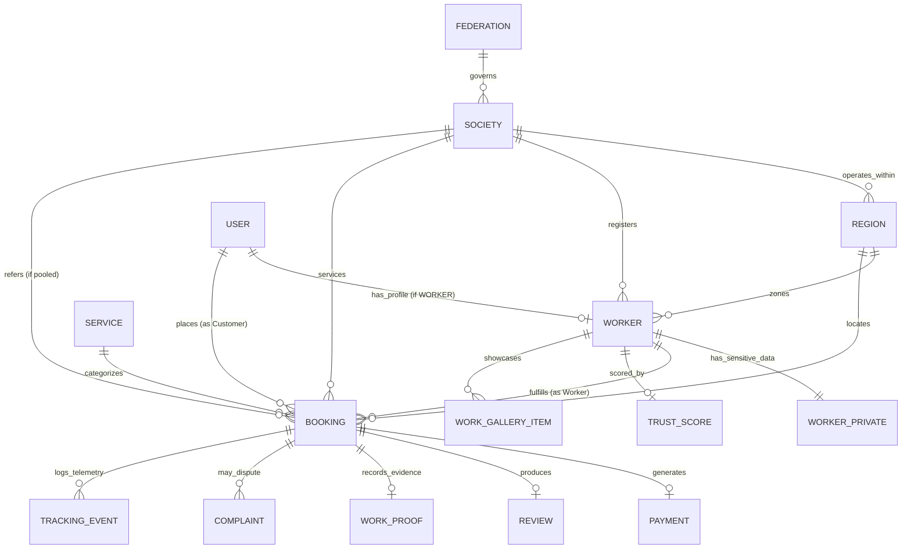

# Canonical Data Contract & Architecture Specification

**Project:** GigSevak (Cooperative Gig Services Platform for Household & Community Services)  
**Document Version:** 1.0.0 — Authoritative Single Source of Truth  
**Target Applications:** `user-frontend`, `worker-frontend`, `admin-frontend`, and `backend` (Node.js/MongoDB)  
**Date:** September 10, 2026  
**Status:** PROPOSED CANONICAL CONTRACT FOR ARCHITECTURAL REVIEW  

---

## 1. Architectural Principles & Identity Governance

### 1.1 Core Principles
1. **Single Source of Truth:** All frontends (`user-frontend`, `worker-frontend`, and `admin-frontend`) must interface with the same canonical data models. Frontend-specific presentation wrappers may exist, but all network payloads and database persistence must adhere to this contract.
2. **Strict Public vs Private Isolation:** Sensitive worker data (Aadhaar, bank account numbers, private phone, full address, insurance claims) is strictly isolated into `WorkerPrivate`. The public `Worker` model contains only operational and reputation attributes safe for consumer discovery.
3. **Canonical Organizational Hierarchy:**
   $$\text{Federation} \longrightarrow \text{Society} \longrightarrow \text{Region} \longrightarrow \text{Worker}$$
   Societies and Regions are first-class database entities with bounded spatial definitions, not loose string attributes.
4. **Authoritative Backend Pricing & Math:** Totals, tax additions, platform commissions, cooperative pooling splits (85% / 10% / 5%), and Trust Score calculations are strictly calculated and enforced on the backend. Frontend applications never dictate price calculations.
5. **Standardized Spatial Telemetry:** All spatial coordinates across the platform strictly utilize the **GeoJSON Point standard** (`[longitude, latitude]`). The coordinate ordering is invariant.

### 1.2 Identity & Reference Conventions
All cross-entity references utilize standardized ID fields:
* `userId`: Primary key of a user account (`UUIDv4` or MongoDB `ObjectId`).
* `workerId`: Primary foreign key linking operational worker records to a `User` identity.
* `workerCode`: Human-readable operational identifier (e.g. `WRK-PUN-0042`), unique across the platform.
* `memberRegistrationNumber`: Official cooperative registrar number issued by the state or NCCT (e.g. `GS-PUN-2026-089` / `COOP-DEL-2021-089`). Stored as a separate business attribute; **never used as the primary database key**.
* `federationId`: Primary key of the apex cooperative body.
* `societyId`: Primary key of the local registered cooperative society.
* `regionId`: Primary key of the geofenced operating territory.
* `serviceId`: Primary key of the service trade.
* `bookingId`: Primary key of the transaction.
* `bookingCode`: Human-readable consumer tracking code (e.g. `KRV-20260910-8841`).
* `reviewId`, `complaintId`, `paymentId`: Unique primary keys for secondary domain entities.

---

## 2. Entity Relationship Model (ERD)



---

## 3. Canonical Entity Definitions

### 3.1 `User`
The central identity and authentication record for all human actors across all portals (Customer, Worker, Society Admin, Federation Admin).

```typescript
interface CanonicalUser {
  _id: string; // ObjectId / UUID
  phone: string; // Required, Unique, E.164 format (e.g. "+919876543210")
  role: 'CUSTOMER' | 'WORKER' | 'SOCIETY_ADMIN' | 'FEDERATION_ADMIN' | 'SYSTEM_ADMIN';
  fullName: string; // Required
  email?: string; // Optional
  avatarUrl?: string; // Public avatar URL
  preferredLanguage: string; // Default: 'hi' (e.g. 'en', 'hi', 'pa', 'mr', 'ta')
  firebaseUid: string; // Unique, indexed for Firebase Auth verification
  status: 'ACTIVE' | 'SUSPENDED' | 'PENDING_ONBOARDING';
  
  // Customer-Specific Convenience Attributes (null for workers/admins)
  customerProfile?: {
    savedAddresses: Array<{
      id: string;
      label: 'Home' | 'Work' | 'Other';
      fullAddress: string;
      landmark?: string;
      city: string;
      pincode: string;
      location: {
        type: 'Point';
        coordinates: [number, number]; // [lng, lat]
      };
      isDefault: boolean;
    }>;
  };

  createdAt: string; // ISO 8601
  updatedAt: string; // ISO 8601
}
```

---

### 3.2 `Worker` (Public Operational Model)
Public profile for discovering, ranking, and assigning workers. Safe for customer visibility.

```typescript
interface CanonicalWorker {
  _id: string; // ObjectId / UUID (workerId)
  userId: string; // Ref -> User._id (One-to-One)
  workerCode: string; // Unique business code (e.g. "WRK-PUN-0042")
  memberRegistrationNumber: string; // Society member registry (e.g. "GS-PUN-2026-089")
  
  // Organizational Hierarchy
  federationId: string; // Ref -> Federation._id
  societyId: string; // Ref -> Society._id
  regionId: string; // Ref -> Region._id
  
  // Trades & Skills
  primaryServiceId: string; // Ref -> Service._id
  serviceIds: string[]; // Ref -> Service._id[]
  experienceYears: number; // Numeric years of field experience
  bio: string; // Professional self-description
  languages: string[]; // Spoken languages (e.g. ["Hindi", "Punjabi", "English"])
  profileImage: string; // Public portrait photo URL
  
  // Operational Availability & Dispatch State
  isAvailable: boolean; // Master online/offline toggle
  availabilityStatus: 'ONLINE' | 'OFFLINE' | 'ON_JOB' | 'ON_BREAK';
  baseServicePrice: number; // Base visit/service rate in INR
  
  // Reputation & Quality Metrics
  rating: number; // Current average rating (1.00 - 5.00)
  reviewCount: number; // Total verified reviews
  completedJobs: number; // Total successfully completed bookings
  trustScore: number; // Current composite trust score (0.0 - 100.0)
  
  // Real-Time Spatial Positioning
  location: {
    type: 'Point';
    coordinates: [number, number]; // [longitude, latitude]
  };
  lastLocationUpdate: string; // ISO 8601
  
  // Administrative Status
  verificationStatus: 'UNVERIFIED' | 'PENDING_DOCS' | 'VERIFIED' | 'REJECTED' | 'SUSPENDED';
  isActive: boolean; // Account operational status
  
  createdAt: string;
  updatedAt: string;
}
```

---

### 3.3 `WorkerPrivate` (Sensitive Information)
Isolated record storing private legal, financial, and welfare credentials. **Never exposed to customers.**

```typescript
interface CanonicalWorkerPrivate {
  _id: string; // ObjectId / UUID
  workerId: string; // Ref -> Worker._id (One-to-One, Indexed)
  userId: string; // Ref -> User._id
  
  // Contact & Personal Identifiers
  phone: string; // Direct worker mobile number
  email?: string;
  dateOfBirth: string; // "YYYY-MM-DD"
  gender: 'MALE' | 'FEMALE' | 'OTHER';
  privateAddress: {
    street: string;
    city: string;
    state: string;
    pincode: string;
  };
  
  // Government KYC & Biometric Verification
  kyc: {
    aadhaarMasked: string; // "XXXX XXXX 1234" (Never store unmasked Aadhaar)
    aadhaarHash: string; // Salted cryptographic hash for duplicate detection
    aadhaarVerified: boolean;
    aadhaarVerifiedAt?: string;
    selfieVerified: boolean;
    selfieVerifiedAt?: string;
    selfieImageUrl?: string; // S3/GCS private authenticated URL
    policeVerificationDocUrl?: string;
    skillCertificateUrls?: string[];
    verificationOfficerId?: string; // Ref -> User._id (Admin)
    verifiedAt?: string;
    verificationNotes?: string;
  };
  
  // Bank Account (Direct Payout Disbursal)
  bankAccount: {
    bankName: string;
    accountNumberMasked: string; // "•••• •••• 4892"
    accountNumberEncrypted: string; // AES-256 encrypted at rest
    ifsc: string;
    branch: string;
    holderName: string;
    verificationStatus: 'PENDING' | 'VERIFIED' | 'FAILED';
  };
  
  // Welfare & Social Security Schemes (PMSBY, PMJJBY, etc.)
  insurance: {
    hasPolicy: boolean;
    policyType?: string; // e.g. "Personal Accident Insurance (PMSBY)"
    provider?: string;
    policyNumber?: string;
    coverageAmount?: number;
    startDate?: string;
    expiryDate?: string;
    policyDocumentUrl?: string;
    nomineeName?: string;
    nomineeRelationship?: string;
  };
  
  // Emergency Contacts
  emergencyContact: {
    name: string;
    relationship: string;
    phone: string;
  };
  
  // Internal Operational Preferences
  schedulePreferences: {
    availableDays: Array<'Mon' | 'Tue' | 'Wed' | 'Thu' | 'Fri' | 'Sat' | 'Sun'>;
    workingHoursStart: string; // "09:00"
    workingHoursEnd: string; // "18:00"
    workType: 'FULL_TIME' | 'PART_TIME';
  };
  toolsAndEquipment: string[]; // e.g. ["Pipe Wrench", "Digital Multimeter"]
  
  // Earnings Ledger
  earnings: {
    totalRevenueLifetime: number;
    pendingPayoutBalance: number;
    disbursedPayoutLifetime: number;
    todayEstimatedEarnings: number;
  };
  
  createdAt: string;
  updatedAt: string;
}
```

---

### 3.4 `Federation`
The top-level apex cooperative body (e.g. National Council for Cooperative Training — NCCT or State Cooperative Union).

```typescript
interface CanonicalFederation {
  _id: string; // ObjectId / UUID
  code: string; // Unique registry code (e.g. "FED-NCCT-NAT")
  name: string; // e.g. "National Cooperative Development Federation"
  state: string; // e.g. "National" or "Punjab"
  headquartersAddress: {
    street: string;
    city: string;
    state: string;
    pincode: string;
  };
  contactEmail: string;
  contactPhone: string;
  adminUserIds: string[]; // Ref -> User._id[]
  isActive: boolean;
  createdAt: string;
  updatedAt: string;
}
```

---

### 3.5 `Society`
A primary local cooperative society registered under the Federation.

```typescript
interface CanonicalSociety {
  _id: string; // ObjectId / UUID
  federationId: string; // Ref -> Federation._id
  code: string; // e.g. "COOP-PUN-JAL-004"
  registrationNumber: string; // Govt registrar number (e.g. "SOC-REG-2021-089")
  name: string; // e.g. "Jalandhar Urban Skilled Workers Cooperative Society"
  
  // Spatial Root & Geofence
  centerLocation: {
    type: 'Point';
    coordinates: [number, number]; // [lng, lat]
  };
  coverageRadiusKm: number; // Default: 5.0 (Standard cluster radius)
  address: {
    street: string;
    city: string;
    state: string;
    pincode: string;
  };
  
  // Administration & Governance
  adminUserIds: string[]; // Ref -> User._id[] (Society Admins)
  bankAccount: {
    bankName: string;
    accountNumberMasked: string;
    ifsc: string;
    holderName: string;
  };
  
  // Public SLA & Trust Metrics
  metrics: {
    trustScore: number; // e.g. 98.4
    activeWorkersCount: number;
    averageResponseTimeMinutes: number; // e.g. 15
    disputeResolutionRatePercent: number; // e.g. 99.8
    yearsActive: number;
  };
  
  status: 'PENDING_APPROVAL' | 'VERIFIED' | 'SUSPENDED';
  createdAt: string;
  updatedAt: string;
}
```

---

### 3.6 `Region`
First-class administrative and dispatch sub-zone within a Society's territory.

```typescript
interface CanonicalRegion {
  _id: string; // ObjectId / UUID
  societyId: string; // Ref -> Society._id
  federationId: string; // Ref -> Federation._id
  code: string; // e.g. "REG-JAL-MODTOWN"
  name: string; // e.g. "Model Town Zone"
  city: string; // e.g. "Jalandhar"
  
  // Geofence Boundary & Anchor
  center: {
    type: 'Point';
    coordinates: [number, number]; // [lng, lat]
  };
  boundary?: {
    type: 'Polygon';
    coordinates: number[][][]; // Array of [lng, lat] rings
  };
  radiusKm: number; // e.g. 3.5
  
  // Operational Parameters
  isEmergencyDispatchActive: boolean;
  isActive: boolean;
  createdAt: string;
  updatedAt: string;
}
```

---

### 3.7 `Service`
Authoritative master catalog of trades and household services.

```typescript
interface CanonicalService {
  _id: string; // ObjectId / UUID (serviceId, e.g. "srv-electrician")
  categoryId: string; // e.g. "home-repair", "cleaning", "appliance-repair"
  name: string; // Default English display name (e.g. "Electrical Repair")
  slug: string; // Unique URL slug (e.g. "electrical-repair")
  
  // 13 Indian Language Localizations
  localizedNames: {
    en: string;
    hi: string;
    pa: string;
    bn: string;
    mr: string;
    gu: string;
    ta: string;
    te: string;
    kn: string;
    ml: string;
    or: string;
    as: string;
    ur: string;
  };
  
  description: string;
  iconUrl: string;
  bannerImageUrl: string;
  
  // Pricing & Execution Bounds
  unit: 'FIXED_VISIT' | 'PER_HOUR' | 'PER_UNIT';
  basePrice: number; // Authoritative minimum labor rate in INR
  estimatedDuration: number; // In minutes (e.g. 120 = 2 hours)
  requiredSkills: string[]; // e.g. ["MCB Diagnostics", "Safety Grounding"]
  
  // Deliverables & Checklist
  includedTasks: string[];
  safetyGuarantees: string[];
  
  isActive: boolean;
  createdAt: string;
  updatedAt: string;
}
```

---

### 3.8 `Booking`
The central transaction coordinating Customer, Worker, Service, Society, and Ledger.

```typescript
interface CanonicalBooking {
  _id: string; // ObjectId / UUID (bookingId)
  bookingCode: string; // Unique consumer code (e.g. "KRV-20260910-8841")
  
  // Parties Involved
  customerId: string; // Ref -> User._id (Customer)
  workerId: string | null; // Ref -> Worker._id (null while REQUESTED / ALLOCATED)
  serviceId: string; // Ref -> Service._id
  
  // Organizational & Spatial Anchors
  federationId: string; // Ref -> Federation._id
  societyId: string; // Ref -> Society._id (Servicing Society)
  referringSocietyId?: string | null; // Ref -> Society._id (If Inter-Coop Pooled)
  regionId: string; // Ref -> Region._id
  
  // Dispatch Modality
  bookingType: 'STANDARD' | 'EMERGENCY_SOS' | 'COMMUNITY_POOL' | 'VOICE_BOOKING';
  isPooled: boolean; // True if serviced by neighboring cooperative
  teamId?: string | null; // UUID grouping multiple bookings for a multi-trade team
  
  // Lifecycle State Machine
  status:
    | 'REQUESTED'
    | 'ALLOCATED'
    | 'ACCEPTED'
    | 'IN_TRANSIT'
    | 'ARRIVED'
    | 'IN_PROGRESS'
    | 'COMPLETED'
    | 'CANCELLED'
    | 'DECLINED';
  
  // Destination
  serviceAddress: {
    fullAddress: string;
    city: string;
    pincode: string;
    landmark?: string;
  };
  serviceLocation: {
    type: 'Point';
    coordinates: [number, number]; // [longitude, latitude]
  };
  
  // Job Scope & Customer Uploads
  description: string; // Customer problem statement
  problemPhotos: string[]; // URLs of customer photo uploads
  scheduledAt: string; // ISO 8601 appointment timestamp
  
  // Authoritative Financial Ledger (Calculated by Backend)
  pricing: {
    baseAmount: number; // Labor charge
    materialCost: number; // Parts purchased on site by worker
    additionalCharges: number; // Approved scope expansions
    platformFee: number; // Fixed platform commission (5%)
    taxes: number; // GST (e.g. 5%)
    totalAmount: number; // Total charged to customer
    
    // Cooperative Revenue Distribution Split
    workerPayout: number; // 85% of labor + 100% of material
    servicingSocietyFee: number; // 10% (standard) or 9% (if pooled)
    referringSocietyFee: number; // 0% (standard) or 1% (if pooled)
    platformFeeAmount: number; // 5% reserve
  };
  paymentStatus: 'PENDING' | 'HELD_IN_ESCROW' | 'PAID' | 'REFUNDED' | 'DISBURSED';
  
  // Cryptographic Start Gate (Anti-Fraud OTP)
  startOtpHash: string; // Salted SHA-256 hash of the 4-digit start PIN
  otpVerifiedAt?: string | null; // Timestamp when worker successfully verified PIN
  
  // Operational Timeline Milestones
  allocatedAt?: string | null;
  acceptedAt?: string | null;
  inTransitAt?: string | null;
  arrivedAt?: string | null;
  startedAt?: string | null; // Work stopwatch begins
  completedAt?: string | null; // Work session finishes
  cancelledAt?: string | null;
  cancellationReason?: string | null;
  
  createdAt: string;
  updatedAt: string;
}
```

---

### 3.9 `Review`
Customer rating and feedback entity attached to a completed booking.

```typescript
interface CanonicalReview {
  _id: string; // ObjectId / UUID (reviewId)
  bookingId: string; // Ref -> Booking._id (Unique: 1 review per booking)
  customerId: string; // Ref -> User._id
  workerId: string; // Ref -> Worker._id
  serviceId: string; // Ref -> Service._id
  
  rating: number; // Integer: 1 to 5
  comment: string; // Customer review text
  tags: string[]; // e.g. ["Punctual", "Expert Diagnosis", "Clean Work"]
  photos?: string[]; // Review photo attachments
  
  // NLP Sentiment Analysis (Processed by AI Microservice)
  sentiment?: {
    label: 'POSITIVE' | 'NEUTRAL' | 'NEGATIVE';
    score: number; // Range: -1.0 to +1.0
    requiresAdminFlag: boolean; // True if highly negative / abusive
  };
  
  createdAt: string;
  updatedAt: string;
}
```

---

### 3.10 `TrustScore`
Dynamic audit record recording calculating breakdowns of a worker's Trust Score.

```typescript
interface CanonicalTrustScore {
  _id: string; // ObjectId / UUID
  workerId: string; // Ref -> Worker._id (Unique per worker)
  overallScore: number; // 0.0 to 100.0 (Normalized composite)
  grade: 'A+' | 'A' | 'B' | 'C' | 'PROBATION';
  
  // Mathematical 5-Factor Breakdown
  breakdown: {
    customerRatingScore: number; // Weight: 40% (Derived from Reviews)
    completionRateScore: number; // Weight: 25% (Completed vs Accepted)
    verificationScore: number; // Weight: 15% (Aadhaar, Skill, Police)
    complaintResolutionScore: number; // Weight: 10% (Inverse of complaints)
    punctualityScore: number; // Weight: 10% (On-time arrival vs ETA)
  };
  
  previousScore: number;
  lastCalculatedAt: string; // ISO 8601
  updatedAt: string;
}
```

---

### 3.11 `WorkGalleryItem`
Curated public craftsmanship showcase displayed on the worker's public profile.

```typescript
interface CanonicalWorkGalleryItem {
  _id: string; // ObjectId / UUID
  workerId: string; // Ref -> Worker._id
  bookingId?: string | null; // Optional Ref -> Booking._id (if derived from gig)
  serviceId: string; // Ref -> Service._id
  
  title: string; // e.g. "Burnt Switchboard Overhaul & Rewiring"
  description: string;
  jobType: string; // e.g. "Emergency MCB & Wiring Repair"
  date: string; // e.g. "14 Aug 2026"
  ratingGiven?: number; // e.g. 5.0
  localityName: string; // e.g. "Model Town, Jalandhar"
  
  // Before-and-After Photographic Proof
  beforeImage: string; // URL
  afterImage: string; // URL
  additionalImages?: string[];
  
  isFeatured: boolean; // Pinned to top of profile
  createdAt: string;
}
```

---

### 3.12 `WorkProof`
Mandatory transactional proof captured during live job execution for audit, quality, and dispute resolution.

```typescript
interface CanonicalWorkProof {
  _id: string; // ObjectId / UUID
  bookingId: string; // Ref -> Booking._id (Unique: 1 proof per booking)
  workerId: string; // Ref -> Worker._id
  
  // Progressive Photographic Evidence
  beforePhotos: string[]; // Mandatory before starting work
  duringPhotos?: string[]; // Optional progress photos
  afterPhotos: string[]; // Mandatory before marking completed
  
  // Execution Metadata
  workerNotes?: string; // Summary of repairs performed
  partsReplaced?: Array<{
    partName: string;
    cost: number;
    receiptImageUrl?: string;
  }>;
  
  submittedAt: string; // ISO 8601
  verifiedAt?: string | null; // When customer or admin approved
  verifiedBy?: string | null; // Customer._id or Admin._id
}
```

---

### 3.13 `Complaint`
Formal grievance filed against a booking, service, or worker.

```typescript
interface CanonicalComplaint {
  _id: string; // ObjectId / UUID (complaintId)
  bookingId: string; // Ref -> Booking._id
  customerId: string; // Ref -> User._id (Complainant)
  workerId: string; // Ref -> Worker._id
  societyId: string; // Ref -> Society._id
  
  type: 
    | 'LATE_ARRIVAL'
    | 'POOR_WORKMANSHIP'
    | 'OVERCHARGING'
    | 'UNPROFESSIONAL_BEHAVIOR'
    | 'DAMAGE_TO_PROPERTY'
    | 'NO_SHOW'
    | 'OTHER';
    
  description: string;
  evidencePhotos: string[]; // Customer proof uploads
  
  status: 'SUBMITTED' | 'UNDER_REVIEW' | 'GUILD_INVESTIGATION' | 'RESOLVED' | 'DISMISSED';
  priority: 'NORMAL' | 'HIGH' | 'URGENT';
  
  assignedOfficerId?: string | null; // Ref -> User._id (Society Inspector)
  assignedOfficerName?: string | null;
  
  timeline: Array<{
    status: string;
    timestamp: string;
    note: string;
    updatedBy: string;
  }>;
  
  resolution?: {
    actionTaken: 'REFUND_ISSUED' | 'REWORK_ORDERED' | 'WORKER_WARNED' | 'DISMISSED';
    refundAmount?: number;
    notes: string;
  };
  resolvedAt?: string | null;
  createdAt: string;
  updatedAt: string;
}
```

---

### 3.14 `Payment`
Financial ledger entity tracking customer checkout and revenue split escrow.

```typescript
interface CanonicalPayment {
  _id: string; // ObjectId / UUID (paymentId)
  bookingId: string; // Ref -> Booking._id
  customerId: string; // Ref -> User._id
  workerId: string; // Ref -> Worker._id
  
  amount: number; // Total amount paid in INR
  breakdown: {
    baseLaborAmount: number;
    materialAmount: number;
    additionalCharges: number;
    platformFee: number;
    taxes: number;
  };
  
  // Payment Gateway Details
  paymentMethod: 'UPI' | 'CREDIT_CARD' | 'DEBIT_CARD' | 'NET_BANKING' | 'CASH';
  gateway: 'RAZORPAY';
  gatewayOrderId: string;
  gatewayPaymentId?: string;
  gatewaySignature?: string;
  
  status: 'PENDING' | 'ESCROW_HELD' | 'SPLIT_DISBURSED' | 'REFUNDED' | 'FAILED';
  
  // Audited Payout Distribution
  distribution: {
    workerShareAmount: number; // 85% labor + 100% material
    workerPayoutStatus: 'PENDING' | 'DISBURSED';
    servicingSocietyAmount: number; // 10% (or 9%)
    referringSocietyAmount: number; // 1% (if pooled)
    platformReserveAmount: number; // 5%
  };
  
  paidAt?: string | null;
  disbursedAt?: string | null;
  createdAt: string;
  updatedAt: string;
}
```

---

### 3.15 `TrackingEvent`
High-frequency GPS ping recorded during transit and active service execution.

```typescript
interface CanonicalTrackingEvent {
  _id: string; // ObjectId / UUID
  bookingId: string; // Ref -> Booking._id (Indexed)
  workerId: string; // Ref -> Worker._id
  
  type: 'DISPATCH_PING' | 'TRANSIT_PING' | 'ARRIVAL_PING' | 'SOS_ALERT';
  
  location: {
    type: 'Point';
    coordinates: [number, number]; // [longitude, latitude]
  };
  speed?: number; // Speed in m/s
  heading?: number; // Heading in degrees (0 - 360)
  
  timestamp: string; // ISO 8601 (TTL Index: expires after 7 days)
}
```

---

## 4. Booking State Machine & Transition Rules

```
                      ┌──────────────────────┐
                      │      REQUESTED       │
                      └──────────┬───────────┘
                                 │
                     (Coop Engine matches Worker)
                                 │
                                 ▼
                      ┌──────────────────────┐
            ┌─────────┤      ALLOCATED       ├──────────┐
            │         └──────────┬───────────┘          │
            │                    │                      │
     (Customer Cancels)    (Worker Accepts)       (Worker Declines)
            │                    │                      │
            ▼                    ▼                      ▼
    ┌───────────────┐ ┌──────────────────────┐ ┌────────────────┐
    │   CANCELLED   │ │       ACCEPTED       │ │    DECLINED    │
    └───────────────┘ └──────────┬───────────┘ └───────┬────────┘
            ▲                    │                     │
            │           (Worker Starts Travel)    (Re-allocate)
            │                    │                     │
            │                    ▼                     │
            │         ┌──────────────────────┐         │
            ├─────────┤      IN_TRANSIT      │         │
            │         └──────────┬───────────┘         │
            │                    │                     │
            │           (Arrives at Doorstep)          │
            │                    │                     │
            │                    ▼                     │
            │         ┌──────────────────────┐         │
            ├─────────┤       ARRIVED        │◄────────┘
            │         └──────────┬───────────┘
            │                    │
            │         (Verify 4-Digit OTP +
            │          Upload Before Photos)
            │                    │
            │                    ▼
            │         ┌──────────────────────┐
            └─────────┤     IN_PROGRESS      │
                      └──────────┬───────────┘
                                 │
                      (Upload After Photos +
                       Collect Final Payment)
                                 │
                                 ▼
                      ┌──────────────────────┐
                      │      COMPLETED       │
                      └──────────────────────┘
```

### State Transition Validation Matrix

| Current State | Target State | Triggering Actor | Required Conditions & Guard Checks | Backend Action Taken |
| :--- | :--- | :--- | :--- | :--- |
| `REQUESTED` | `ALLOCATED` | System / Matcher | Candidate worker found within 5km radius matching service category skill. | `booking.workerId` set; FCM push alert dispatched to worker. |
| `REQUESTED` | `CANCELLED` | Customer | Customer cancels before worker is accepted. | No cancellation penalty. Escrow released. |
| `ALLOCATED` | `ACCEPTED` | Worker | Worker clicks "Accept Gig" within 60-second dispatch countdown. | Status updated to `ACCEPTED`; customer notified with worker contact. |
| `ALLOCATED` | `DECLINED` | Worker / Timeout | Worker clicks "Decline" or 60s expires. | Re-enters matching queue; pool engine expands radius (5km to 12km). |
| `ACCEPTED` | `IN_TRANSIT` | Worker | Worker presses "Start Travel". | Customer UI transitions to live GPS tracker; ETA stream activates. |
| `IN_TRANSIT` | `ARRIVED` | Worker | Worker within 200m geofence or confirms doorstep arrival. | Customer UI prompts: *"Share OTP with worker"*. OTP displayed. |
| `ARRIVED` | `IN_PROGRESS`| Worker | **1.** Customer provides 4-digit OTP.<br>**2.** Worker enters OTP (`verifyStartOtp`).<br>**3.** Worker uploads $\ge 1$ `beforePhotos`. | Backend verifies `SHA-256(enteredOtp) === booking.startOtpHash`. Sets `otpVerifiedAt = now()` and starts stopwatch. |
| `IN_PROGRESS`| `COMPLETED` | Worker | **1.** Worker uploads $\ge 1$ `afterPhotos`.<br>**2.** Payment verified (`PAID`). | Stopwatch stopped. Sets `completedAt = now()`. Escrow split released (85/10/5). Reviews unlocked. |
| `ACCEPTED` / `IN_TRANSIT` / `ARRIVED` | `CANCELLED` | Customer | Late cancellation fee applies if worker has already traveled. | System logs cancellation penalty; updates worker trust score. |
| `IN_PROGRESS`| `CANCELLED` | System / Admin | Emergency SOS dispute or severe hazard reported. | Job halted; dispute ticket automatically generated for Society Admin. |

---

## 5. Role-Based Access Control (RBAC) Matrix

| Entity & Action | Customer | Worker | Society Admin | Federation Admin | System Admin |
| :--- | :--- | :--- | :--- | :--- | :--- |
| **`User` (Self)** | Read / Update | Read / Update | Read / Update | Read / Update | Full CRUD |
| **`Worker` (Public)** | Read Only | Read Only | Read / Update (Assigned) | Read Only | Full CRUD |
| **`WorkerPrivate`** | **No Access** | Read / Update (Self) | Read / Verify (Society Workers) | Read Only (Auditing) | Full CRUD |
| **`Society` / `Region`** | Read Only | Read Only | Read Only | Read / Update | Full CRUD |
| **`Service` Catalog** | Read Only | Read Only | Read Only | Read / Update | Full CRUD |
| **`Booking`** | CRUD (Own) | Read / Update (Assigned) | Read / Reassign (Society) | Read Only | Full CRUD |
| **`Booking.startOtp`**| **Read Only** | **Write / Verify Only** | Audit Logs | **No Access** | Full CRUD |
| **`WorkProof`** | Read (Own Gig) | Create / Update (Assigned) | Read / Verify | Read Only | Full CRUD |
| **`Complaint`** | Create / Read (Own) | Read (Assigned Dispute) | Read / Investigate / Resolve | Read Only | Full CRUD |
| **`Payment` Ledger** | Read (Own Receipts) | Read (Own Earnings) | Read (Society Split) | Read (Federation Ledger) | Full CRUD |
| **`TrustScore` Logs**| Read (Composite) | Read (Breakdown & Score) | Read / Audit | Read (Heatmaps) | Full CRUD |

---

## 6. Migration & Field Mapping Table

How existing fields in `worker-frontend` and `user-frontend` map cleanly to the Canonical Specification:

### 6.1 Worker Model Mapping

| Existing Worker Frontend Field | Existing User Frontend Field | Canonical Field | Resolution & Normalization Rule |
| :--- | :--- | :--- | :--- |
| `WorkerProfile.memberId` | `Worker.id` (`"el-1"`) | `Worker._id` + `Worker.workerCode` | Use stable ObjectId/UUID for `_id`; generate canonical `workerCode` (`WRK-PUN-0042`). |
| `WorkerProfile.memberId` | `Worker.coopRegNo` | `Worker.memberRegistrationNumber` | Retain as separate official cooperative registration attribute. |
| `WorkerProfile.name` | `Worker.fullName` | `User.fullName` | Map to unified `User.fullName`. |
| `WorkerProfile.avatar` | `Worker.avatarUrl` | `Worker.profileImage` / `User.avatarUrl` | Normalize to `Worker.profileImage`. |
| `WorkerProfile.role` / `primarySkill` | `Worker.profession` / `tier` | `Worker.primaryServiceId` + `Service.name` | Discontinue hardcoded profession string; link foreign key to `Service._id`. |
| `WorkerProfile.coopBranch` | `Worker.cooperative` | `Worker.societyId` $\rightarrow$ `Society.name` | Normalize string to `Society._id` foreign key. |
| `WorkerProfile.yearsOfExperience` (`"5"`) | `Worker.experienceYears` (`8`) | `Worker.experienceYears` (`number`) | Normalize to numeric integer; discard string format. |
| `WorkerProfile.isAvailable` | `Worker.availableNow` / `is_available` | `Worker.isAvailable` + `availabilityStatus` | Use boolean `isAvailable` and enum `availabilityStatus`. |
| `WorkerProfile.preferredLanguage` | `Worker.languages` (`string[]`) | `Worker.languages` (`string[]`) | Worker profile stores spoken languages (`string[]`); app UI locale stored in `User.preferredLanguage`. |
| `WorkerProfile.aboutMe` | `Worker.bio` | `Worker.bio` | Canonical name: `bio`. |
| `WorkerProfile.servicesOffered[]` | `Worker.skills[]` | `Worker.serviceIds[]` | Discontinue arbitrary strings; link to canonical `Service._id[]`. |
| *Missing* | `Worker.trustScore` | `Worker.trustScore` | Introduce full 5-factor TrustScore calculation to worker portal. |
| `WorkerProfile.totalJobs` | `Worker.jobsCompleted` | `Worker.completedJobs` | Canonical name: `completedJobs`. |
| *Missing on profile* | `Worker.basePrice` | `Worker.baseServicePrice` | Store default base service price on canonical worker model. |
| `LocationData.coordinates` (`{lat, lng}`) | *Missing in mock* / GeoJSON in DB | `Worker.location` (`GeoJSON Point`) | Strictly standardize to `{ type: "Point", coordinates: [lng, lat] }`. |
| `WorkerProfile.portfolio[]` | `Worker.workGallery[]` | `WorkGalleryItem[]` | Separate public portfolio from transactional job proof. |
| `WorkerProfile.bankAccount` | *Missing (role-specific)* | `WorkerPrivate.bankAccount` | Retain exclusively in `WorkerPrivate`. |
| `WorkerProfile.insurance` | *Missing (role-specific)* | `WorkerPrivate.insurance` | Retain exclusively in `WorkerPrivate`. |
| `WorkerProfile.kyc` | `verificationBadges[]` | `WorkerPrivate.kyc` + `Worker.verificationStatus` | Sensitive docs in `WorkerPrivate`; verified badge on public `Worker`. |

---

### 6.2 Booking Model Mapping

| Existing Worker Frontend Field | Existing User Frontend Field | Canonical Field | Resolution & Normalization Rule |
| :--- | :--- | :--- | :--- |
| `JobItem.id` (`"job-1"`) | `Booking.bookingId` (`"BK-1001"`) | `Booking._id` + `Booking.bookingCode` | Standardize `_id` as UUID/ObjectId; human tracking code as `bookingCode` (`KRV-20260910-8841`). |
| `JobItem.clientName` | `activeBooking.worker` (embedded) | `Booking.customerId` $\rightarrow$ `User.fullName` | Discontinue embedding full objects; use `customerId` foreign key. |
| `JobItem.clientAddress` | `activeBooking.address` | `Booking.serviceAddress.fullAddress` | Normalize into structured `serviceAddress` object. |
| `JobItem.clientPhone` | *Missing on booking* | `User.phone` (via `customerId`) | Worker accesses phone via authorized API query on `customerId`. |
| `JobItem.scheduledTime` | `activeBooking.timeSlot` | `Booking.scheduledAt` (ISO 8601) | Replace loose string with standard ISO 8601 timestamp. |
| `JobItem.description` | `Booking.details.specialInstructions`| `Booking.description` | Canonical name: `description`. |
| `JobItem.customerPhotos[]` | `Booking.details.uploadedImage` | `Booking.problemPhotos[]` | Normalize to array of photo URLs (`string[]`). |
| `JobItem.status` (`'pending'`, etc.) | `Booking.status` (`'Accepted'`, etc.)| `Booking.status` (Enum) | Enforce canonical scream-case enum (`REQUESTED` ... `COMPLETED`). |
| `JobItem.price` (`"₹450"`) | `activeBooking.amountPaid` (`650`) | `Booking.pricing.totalAmount` | Store as numeric integer/float in INR; discard currency symbols. |
| `CompletedJob.materialCost` | *Missing in user UI* | `Booking.pricing.materialCost` | Add dynamic material cost field to canonical pricing model. |
| `OtpVerificationModal.mockOtp` (`"1234"`)| *Missing in user UI* | `Booking.startOtpHash` | Backend hashes OTP; Customer UI displays OTP; Worker verifies OTP. |
| `JobItem.beforeWorkPhoto` | *Missing on booking* | `WorkProof.beforePhotos[]` | Store in dedicated `WorkProof` entity linked by `bookingId`. |
| `JobItem.afterWorkPhoto` | `ReviewPage.photo` | `WorkProof.afterPhotos[]` | Store in dedicated `WorkProof` entity linked by `bookingId`. |

---

## 7. Unresolved Conflicts Requiring Human Approval

The following technical and business policy conflicts have been identified during this audit and require stakeholder alignment:

### Conflict 1: Geographic Test Region Alignment
* **Current State:** `worker-frontend` mock data is set in **Punjab** (Jalandhar, Kapurthala), while `user-frontend` is set in **Delhi NCR** (Lajpat Nagar, South Delhi).
* **Decision Needed:** Which geographic territory should be the official primary pilot cluster for cross-frontend end-to-end testing?
  * *Option A (Recommended):* Anchor all seed data to **Jalandhar / Kapurthala, Punjab** (matches NCCT state pilot and existing Google Maps integration in worker-frontend).
  * *Option B:* Anchor all seed data to **South Delhi (Lajpat Nagar / Defence Colony)**.

### Conflict 2: On-Site Material Cost Authorization Flow
* **Current State:** `worker-frontend` allows workers to add replacement part costs (e.g. ₹250 for an MCB), while `user-frontend` charges a rigid upfront price during checkout.
* **Decision Needed:** How should on-site material additions be authorized?
  * *Option A (Recommended):* Worker submits material cost + photo of receipt in worker app $\rightarrow$ Customer receives instant push notification / in-app modal to approve extra charge $\rightarrow$ Extra charge processed via UPI/Cash upon completion.
  * *Option B:* Rigid labor-only pricing. All replacement parts must be purchased independently by the customer.

### Conflict 3: Moment of OTP Visibility to Customer
* **Current State:** Worker app blocks work initiation until OTP is provided. User app currently has no OTP screen.
* **Decision Needed:** When should the 4-digit start OTP become visible to the customer?
  * *Option A (Recommended - High Security):* OTP becomes visible **ONLY when booking status changes to `ARRIVED`** (prevents customer from giving OTP over phone before worker arrives at doorstep).
  * *Option B:* OTP becomes visible as soon as the booking is `ACCEPTED`.

### Conflict 4: Multi-Artisan Community Pooling Worker Experience
* **Current State:** `user-frontend` allows booking a multi-trade team (e.g. 2 Electricians + 1 Plumber on `CommunityPoolPage.jsx`), while `worker-frontend` has no team awareness.
* **Decision Needed:** Should each worker in a pooled team receive an individual independent `Booking` record linked by a shared `teamId`, or should there be a specialized multi-worker view in `worker-frontend`?
  * *Option A (Recommended):* Each worker receives an individual `Booking` with identical destination and `teamId`. Worker sees a badge: *"Part of 3-Member Society Team"*.

---

*This canonical specification is ready for review. No existing frontend files have been modified or deleted.*
