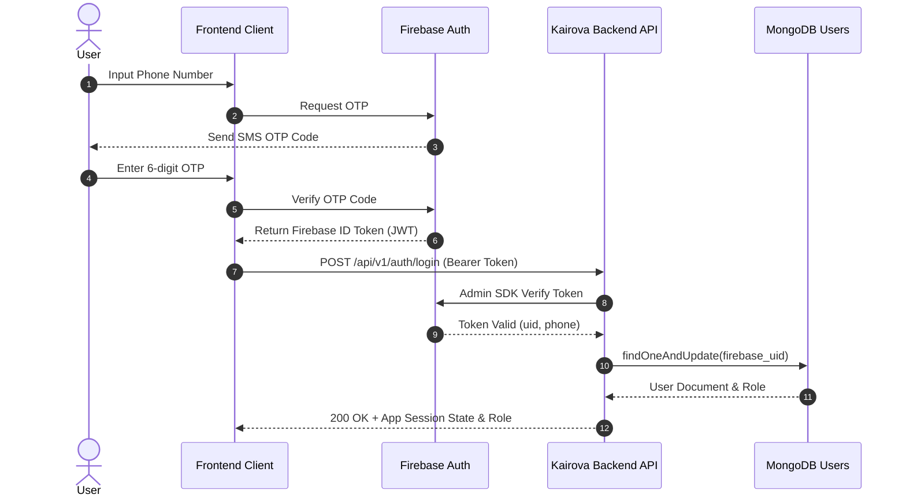
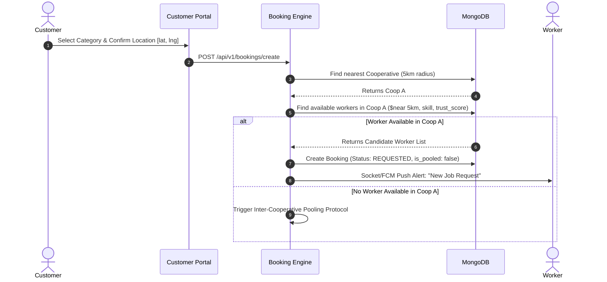
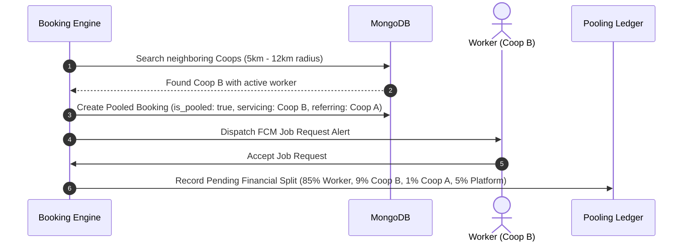
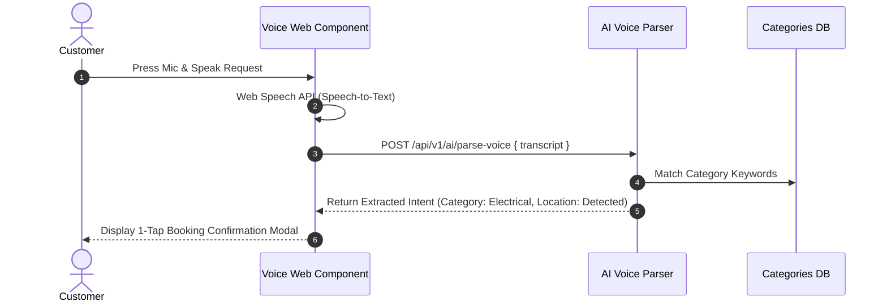
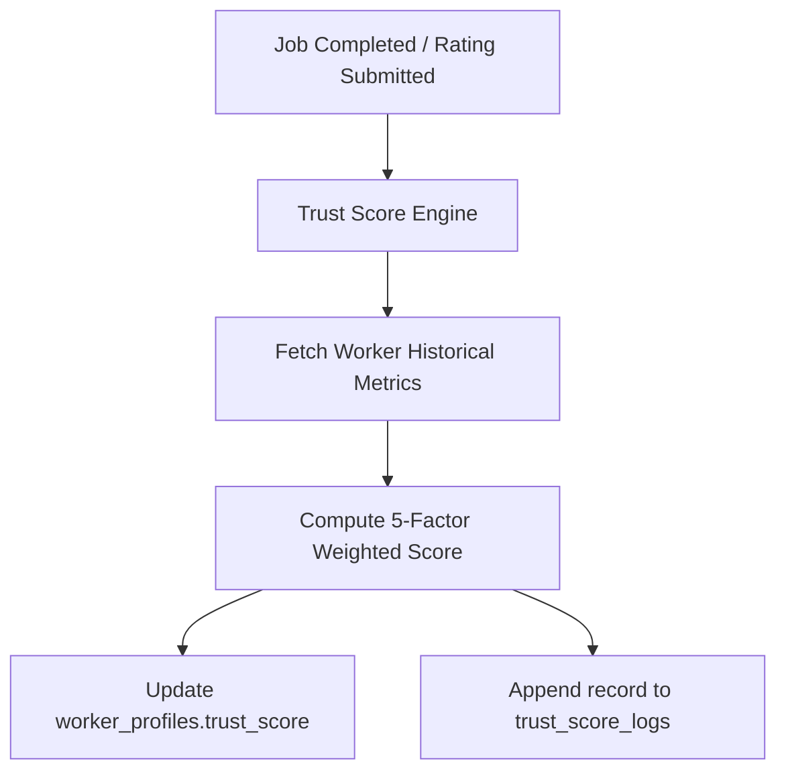

# Production-Grade Software Architecture Document

## Project Name: KAIROVA
**System Architect:** Senior Solution Architect & SIH Technical Lead  
**Document Version:** 1.0.0  

---

## 1. High-Level Architectural Paradigm & Architectural Decision Record (ADR)

### 1.1 Microservices vs Modular Monolith Decision
**Decision:** **Modular Monolith Architecture** (Node.js/Express with domain-isolated modules).

```
                            KAIROVA SYSTEM BOUNDARY
 ┌─────────────────────────────────────────────────────────────────────────────┐
 │ API GATEWAY / EXPRESS ROUTER (Rate Limiting, CORS, Firebase Auth Guard)     │
 ├──────────────┬──────────────┬──────────────┬──────────────┬─────────────────┤
 │ Auth Module  │ Booking &    │ Cooperative  │ AI & Trust   │ Real-time       │
 │ & Profiles   │ Dispatch     │ Pooling      │ Engine       │ Socket & FCM    │
 ├──────────────┴──────────────┴──────────────┴──────────────┴─────────────────┤
 │ shared infrastructure: MongoDB Mongoose Models, Redis Cache, Razorpay SDK   │
 └─────────────────────────────────────────────────────────────────────────────┘
```

**Rationale for SIH & Production Scalability:**
* **Hackathon Velocity:** Prevents microservice operational overhead (service discovery, distributed transactions, inter-service network failure during live demos).
* **High Cohesion, Low Coupling:** Each module (`booking`, `pooling`, `trust_score`, `ai`) has strict boundaries and separate internal folder structures, allowing instant future extraction into independent microservices post-SIH.
* **Shared In-Memory Event Bus:** Enables sub-millisecond event dispatching between booking creation, trust score updates, and real-time worker notifications.

---

## 2. Component Architecture Overview

### 2.1 Frontend Architecture (React 18 + Vite PWA)
* **Framework:** React 18, Vite, Tailwind CSS / Custom CSS.
* **Routing & Portals:** Single React application with Role-Based Guarded Routing (`/customer/*`, `/worker/*`, `/admin/*`).
* **State Management:** React Context API for global session state + Custom Hooks for async API data (`useBooking`, `useWorkerLocation`, `useVoiceInput`).
* **Browser APIs:** Web Speech API (`webkitSpeechRecognition`) for Voice Booking, Geolocation API for GPS pings, Web Worker for background IndexedDB offline sync.

### 2.2 Backend Architecture (Node.js + Express + Socket.io)
* **API Gateway / Router:** Express app serving as unified ingress with helmet security headers, rate limiting, and CORS validation.
* **Real-time Server:** Integrated Socket.io server managing worker tracking rooms and customer status subscriptions.
* **Background Worker / Cron Jobs:** `node-cron` orchestrating hourly demand aggregation and daily trust score decay recalculations.
* **AI Helper Microservice:** Lightweight Python FastAPI microservice dedicated to running demand prediction models and text sentiment analysis.

---

## 3. Core System Workflows & Sequence Diagrams

### 3.1 Authentication & Profile Lifecycle Flow
1. User enters mobile number in frontend.
2. Firebase SDK sends SMS OTP.
3. User enters OTP; Firebase returns ID Token (`JWT`).
4. Frontend attaches `Authorization: Bearer <ID_TOKEN>` to backend requests.
5. Backend `authGuard` middleware validates token with Firebase Admin SDK, extracts `phone` & `uid`, and matches or creates record in MongoDB `users` collection.



---

### 3.2 Booking & Worker Matching Flow (With 5km Geofence)
1. Customer selects service category and confirms location `[lat, lng]`.
2. Backend queries `cooperatives` using MongoDB `$near` spherical query to identify local Coop A (5km radius).
3. Backend queries `worker_profiles` within Coop A for active (`is_available: true`), verified, idle workers matching requested category skill.
4. **Primary Match Found:** Candidate workers sorted by `trust_score` and distance.
5. System dispatches socket notification + FCM push alert to top worker.



---

### 3.3 Inter-Cooperative Pooling Flow
When local Cooperative A has 0 available workers:
1. Booking engine expands search radius (5km to 12km).
2. Nearest neighboring Cooperative B with an available verified worker is identified.
3. Order is assigned to Cooperative B's worker.
4. `bookings.is_pooled` is set to `true`.
5. `servicing_cooperative_id` set to Coop B; `referring_cooperative_id` set to Coop A.
6. Financial ledger automatically locks payout split: **85% Worker / 9% Coop B / 1% Coop A / 5% Platform**.



---

### 3.4 Emergency SOS Booking Flow
1. Customer clicks "EMERGENCY SOS" button on Customer Portal.
2. App sends high-priority payload with current GPS coordinates.
3. System bypasses standard recommendation ranking and broadcasts an instant alarm notification to **ALL verified active workers within 7km**.
4. First worker to hit "ACCEPT" is instantly assigned the SOS job.
5. System notifies Cooperative Admin dashboard with live alert banner for safety monitoring.

---

### 3.5 Voice Booking Flow
1. Customer clicks Voice Microphone icon and speaks (e.g., "Need electrician near Lajpat Nagar").
2. Web Speech API converts audio to raw transcript text.
3. Frontend sends text to `/api/v1/ai/parse-voice`.
4. Backend/Python NLP engine extracts:
   * `category`: mapped to `electrical-repair`
   * `urgency`: `NORMAL` or `HIGH`
   * `location_string`: `Lajpat Nagar`
5. System returns pre-filled booking confirmation card to customer for 1-tap confirmation.



---

## 4. AI & Smart Automation Subsystem Architectures

### 4.1 Trust Score Engine Architecture
* **Trigger:** Invoked automatically upon every job completion or rating submission.
* **Calculation Pipeline:**
  ```
  TrustScore = (RatingAvg / 5 * 40) + (CompletedJobs / AcceptedJobs * 25) + 
               (VerificationStatus * 15) + ((1 - ComplaintRate) * 10) + (OnTimeArrivalRate * 10)
  ```
* **Storage:** Updates `worker_profiles.trust_score` and writes an audit log to `trust_score_logs`.



---

### 4.2 Demand Forecasting Architecture
* **Data Source:** Aggregated historical booking volume bucketed by 1-hour windows and 5km geofences.
* **Execution:** Hourly background worker aggregates dataset into `demand_forecast_grids`.
* **Model:** Moving average + weekly seasonal coefficient calculator running in Python FastAPI service.
* **Output:** Generates `predicted_demand_level` (`LOW`, `MEDIUM`, `HIGH`, `CRITICAL_DEFICIT`) displayed as a real-time visual heatmap on the Admin Dashboard.

---

### 4.3 Sentiment Analysis Architecture
* **Trigger:** Customer submits star rating and review text.
* **Processing:** Text sent to NLP sentiment engine (AFINN lexicon / VADER analysis).
* **Output:**
  * Score \( > +0.25 \): `POSITIVE`
  * Score \( -0.25 \le S \le +0.25 \): `NEUTRAL`
  * Score \( < -0.25 \): `NEGATIVE`
* **Action:** Negative reviews automatically set `requires_admin_flag: true` in `review_sentiments` and trigger an emergency dispute ticket on the Admin Dashboard.

---

## 5. Real-Time Tracking, Payments & API Gateway Architecture

### 5.1 Real-Time Tracking Architecture (Socket.io)
```
  [Worker Phone GPS] ──(Socket.io Ping: emit 'location_update')──► [Node.js Gateway]
                                                                        │
                                                         ┌──────────────┴──────────────┐
                                                         ▼                             ▼
                                              [MongoDB tracking_logs]     [Socket Room: booking_123]
                                               (Persisted for history)          │
                                                                                ▼
                                                                     [Customer Mobile Map]
                                                                     (Smooth marker movement)
```

### 5.2 Payment & Revenue Settlement Architecture (Razorpay)
1. Customer initiates payment ➔ Backend calls Razorpay API to create `Razorpay Order`.
2. Customer completes checkout via Razorpay modal (Test Mode).
3. Razorpay webhook fires `/api/v1/payments/webhook`.
4. Backend verifies cryptographic signature (`x-razorpay-signature`).
5. Upon verification, booking status changes to `PAID`, and automated revenue distribution entries are generated:
   * **Worker Payout Balance:** +85%
   * **Servicing Coop Balance:** +10% (or +9% if pooled)
   * **Referring Coop Balance:** +1% (if pooled)
   * **Kairova Platform Reserve:** +5%

---

## 6. API Gateway Route Design & Endpoint Architecture

| Method | Endpoint | Access Guard | Purpose |
| :--- | :--- | :--- | :--- |
| `POST` | `/api/v1/auth/login` | Public (Firebase JWT) | Authenticate user & issue session |
| `GET` | `/api/v1/services` | Public | Fetch service catalog |
| `POST` | `/api/v1/bookings/create` | Customer | Create booking (Standard/SOS/Voice) |
| `GET` | `/api/v1/bookings/:id/track` | Customer / Worker | Stream live GPS track |
| `POST` | `/api/v1/worker/availability` | Worker | Toggle ONLINE/OFFLINE status |
| `POST` | `/api/v1/worker/location` | Worker | Upload current GPS coordinates |
| `GET` | `/api/v1/admin/verification-queue` | Coop Admin | Fetch unverified workers |
| `POST` | `/api/v1/admin/verify-worker` | Coop Admin | Approve/Reject worker profile |
| `GET` | `/api/v1/admin/demand-heatmap` | Coop Admin | Fetch demand forecast grids |
| `GET` | `/api/v1/admin/pooling-ledger` | Coop Admin | Fetch inter-coop referral fees |
| `POST` | `/api/v1/ai/parse-voice` | Customer | Parse speech transcript to intent |
| `POST` | `/api/v1/payments/webhook` | Webhook (Razorpay) | Process payment signature |

---

## 7. Deployment & Infrastructure Architecture

```
                        PRODUCTION DEPLOYMENT TOPOLOGY
                                    ┌───────────────────────┐
                                    │   Cloudflare CDN      │
                                    │ (SSL, DDoS, DNS)      │
                                    └───────────┬───────────┘
                                                │
                                                ▼
                                    ┌───────────────────────┐
                                    │ AWS ALB / NGINX Ingress│
                                    └───────────┬───────────┘
                                                │
                 ┌──────────────────────────────┴──────────────────────────────┐
                 ▼                                                             ▼
  ┌─────────────────────────────┐                               ┌─────────────────────────────┐
  │ React Web App (Vite Build)  │                               │ Node.js Express API App     │
  │ Deployed on Vercel / Netlify│                               │ Containerized Docker on EC2 │
  └─────────────────────────────┘                               └──────────────┬──────────────┘
                                                                               │
                                               ┌───────────────────────────────┴───────────────────────────────┐
                                               ▼                                                               ▼
                                ┌─────────────────────────────┐                                 ┌─────────────────────────────┐
                                │ MongoDB Atlas Cluster       │                                 │ Python FastAPI AI Service   │
                                │ (Primary + Replicas + Geo)  │                                 │ Docker Container on AWS EC2 │
                                └─────────────────────────────┘                                 └─────────────────────────────┘
```

---

## 8. Data Flow Diagram (DFD Level-1)

```mermaid
graph TD
    Customer([Customer]) -->|1. Book Service / Voice / SOS| API Gateway
    Worker([Gig Worker]) -->|2. Toggle Location & Availability| API Gateway
    CoopAdmin([Cooperative Admin]) -->|3. Verify Docs & Monitor Heatmap| API Gateway
    
    API Gateway -->|Auth Validation| FirebaseAuth[Firebase Auth API]
    API Gateway -->|Read/Write Bookings & Users| MongoDB[(MongoDB Database)]
    
    API Gateway -->|Submit Voice/Review| AIEngine[Python AI Microservice]
    AIEngine -->|Trust & Sentiment Results| MongoDB
    
    API Gateway -->|Broadcast GPS & Job Alert| SocketServer[Socket.io & FCM Engine]
    SocketServer -->|Push Notification| Worker
    SocketServer -->|Real-time Tracking| Customer
    
    API Gateway -->|Initiate Payment| Razorpay[Razorpay Gateway]
    Razorpay -->|Webhook Split Confirmation| API Gateway
    API Gateway -->|Log 85-10-5 Split| PoolingLedger[(Inter-Coop Ledger)]
```
