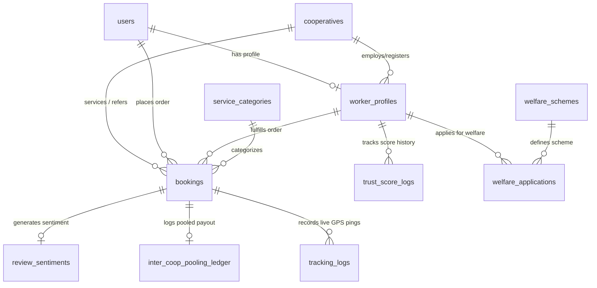

# Production-Grade MongoDB Database Design Document

## Project Name: KAIROVA
**System Architect:** Senior MongoDB & SIH Solution Architect  
**Database Technology:** MongoDB 6.0+ (Document Store with 2dsphere Spatial Indexing)  
**Document Version:** 1.0.0  

---

## 1. Architectural Strategy & Collection Classification

The Kairova database design follows MongoDB best practices: balancing **document embedding** for atomic reads (e.g., pricing splits inside bookings) with **referential links** (`ObjectId`) for normalized cross-entity relationships (e.g., Workers linked to Cooperative Societies).

```
                           KAIROVA DATABASE SCHEMA
                                     │
         ┌───────────────────────────┼───────────────────────────┐
         ▼                           ▼                           ▼
  CORE COLLECTIONS            AI COLLECTIONS            ANALYTICS COLLECTIONS
  ├── users                   ├── trust_score_logs      ├── demand_forecast_grids
  ├── worker_profiles         ├── review_sentiments     └── inter_coop_pooling_ledger
  ├── cooperatives            └── voice_booking_logs
  ├── service_categories
  ├── bookings
  ├── tracking_logs
  ├── welfare_schemes
  └── welfare_applications
```

---

## 2. Core Collections

### 2.1 `users`
* **Purpose:** Central entity storing authentication details, common user profile data, and roles across Customer, Worker, and Admin portals.
* **Fields & Data Types:**
  * `_id`: `ObjectId` (Primary Key)
  * `phone`: `String` (Required, Unique, E.164 format e.g., `+919876543210`)
  * `role`: `String` (Enum: `CUSTOMER`, `WORKER`, `COOP_ADMIN`, `SYSTEM_ADMIN`)
  * `full_name`: `String` (Required)
  * `email`: `String` (Optional)
  * `avatar_url`: `String` (Optional)
  * `preferred_language`: `String` (Default: `hi`, options: `hi`, `en`, `mr`, `ta`, etc.)
  * `firebase_uid`: `String` (Required, Unique, indexed for Firebase Auth lookups)
  * `status`: `String` (Enum: `ACTIVE`, `SUSPENDED`, `INCOMPLETE`)
  * `created_at`: `Date` (Auto timestamp)
  * `updated_at`: `Date` (Auto timestamp)
* **Relationships:**
  * One-to-One with `worker_profiles` (if `role === 'WORKER'`)
  * Referenced in `bookings.customer_id`
* **Required Indexes:**
  * `{ phone: 1 }` (Unique)
  * `{ firebase_uid: 1 }` (Unique)
  * `{ role: 1, status: 1 }`

---

### 2.2 `cooperatives`
* **Purpose:** Stores Cooperative Societies registered under NCCT, their geofenced cluster centers, and administrative credentials.
* **Fields & Data Types:**
  * `_id`: `ObjectId`
  * `coop_code`: `String` (Unique registration ID, e.g., `NCCT-DEL-042`)
  * `name`: `String` (e.g., "South Delhi Skilled Workers Cooperative Society")
  * `registration_number`: `String` (Govt registry number)
  * `center_location`: `Object` (GeoJSON Point: `{ type: "Point", coordinates: [lng, lat] }`)
  * `coverage_radius_km`: `Number` (Default: `5.0`)
  * `address`: `Object` (`{ street: String, city: String, state: String, pincode: String }`)
  * `admin_user_ids`: `Array<ObjectId>` (Refs to `users`)
  * `bank_details`: `Object` (`{ account_number: String, ifsc: String, bank_name: String }`)
  * `total_active_workers`: `Number` (Default: `0`)
  * `status`: `String` (Enum: `PENDING_APPROVAL`, `VERIFIED`, `SUSPENDED`)
  * `created_at`: `Date`
* **Relationships:**
  * One-to-Many with `worker_profiles`
  * Referenced in `bookings.servicing_cooperative_id` and `referring_cooperative_id`
* **Required Indexes:**
  * `{ center_location: "2dsphere" }` (CRITICAL for spatial cluster matching)
  * `{ coop_code: 1 }` (Unique)

---

### 2.3 `worker_profiles`
* **Purpose:** Operational profile for gig workers, skill matrix, location status, trust score, and cooperative membership.
* **Fields & Data Types:**
  * `_id`: `ObjectId`
  * `user_id`: `ObjectId` (Ref to `users`, Unique)
  * `cooperative_id`: `ObjectId` (Ref to `cooperatives`, Required)
  * `skills`: `Array<ObjectId>` (Refs to `service_categories`)
  * `verification_status`: `String` (Enum: `UNVERIFIED`, `PENDING_DOCS`, `VERIFIED`, `REJECTED`)
  * `verification_docs`: `Array<Object>` (`[{ doc_type: "AADHAAR"|"SKILL_CERT", file_url: String, verified_by: ObjectId, verified_at: Date }]`)
  * `current_location`: `Object` (GeoJSON Point: `{ type: "Point", coordinates: [lng, lat] }`)
  * `last_location_update`: `Date`
  * `is_available`: `Boolean` (Default: `false` - Availability toggle)
  * `trust_score`: `Number` (Default: `75.0`, Range: 0 to 100)
  * `total_jobs_completed`: `Number` (Default: `0`)
  * `total_jobs_accepted`: `Number` (Default: `0`)
  * `active_booking_id`: `ObjectId` (Ref to `bookings`, null if idle)
  * `bank_account`: `Object` (`{ account_number: String, ifsc: String, holder_name: String }`)
* **Relationships:**
  * Belongs to `cooperatives`
  * One-to-Many with `bookings`
  * One-to-Many with `trust_score_logs`
* **Required Indexes:**
  * `{ current_location: "2dsphere" }` (CRITICAL for spatial nearest-worker queries)
  * `{ cooperative_id: 1, is_available: 1, verification_status: 1 }`
  * `{ trust_score: -1 }`

---

### 2.4 `service_categories`
* **Purpose:** Master catalog of household and community services.
* **Fields & Data Types:**
  * `_id`: `ObjectId`
  * `name`: `String` (e.g., "Electrical Repair", "Plumbing", "Elderly Care")
  * `slug`: `String` (e.g., `electrical-repair`)
  * `icon_url`: `String`
  * `base_price`: `Number` (INR)
  * `price_unit`: `String` (e.g., "PER_HOUR", "FIXED_VISIT")
  * `estimated_duration_mins`: `Number`
  * `is_active`: `Boolean` (Default: `true`)
* **Relationships:**
  * Referenced in `worker_profiles.skills` and `bookings.service_category_id`

---

### 2.5 `bookings`
* **Purpose:** Core transactional document storing booking lifecycle, locations, voice/SOS flags, financial split, and pooling tracking.
* **Fields & Data Types:**
  * `_id`: `ObjectId`
  * `booking_code`: `String` (Unique, e.g., `KRV-20260905-8841`)
  * `customer_id`: `ObjectId` (Ref to `users`)
  * `worker_id`: `ObjectId` (Ref to `worker_profiles`, null initially during matching)
  * `service_category_id`: `ObjectId` (Ref to `service_categories`)
  * `servicing_cooperative_id`: `ObjectId` (Ref to `cooperatives`)
  * `referring_cooperative_id`: `ObjectId` (Ref to `cooperatives`, populated during pooling)
  * `is_pooled`: `Boolean` (Default: `false`)
  * `booking_type`: `String` (Enum: `STANDARD`, `EMERGENCY_SOS`, `VOICE_BOOKING`)
  * `status`: `String` (Enum: `REQUESTED`, `ALLOCATED`, `ACCEPTED`, `IN_TRANSIT`, `IN_PROGRESS`, `COMPLETED`, `CANCELLED`)
  * `service_location`: `Object` (GeoJSON Point: `{ type: "Point", coordinates: [lng, lat] }`)
  * `service_address`: `Object` (`{ full_address: String, pincode: String, landmark: String }`)
  * `pricing`: `Object` (Embedded Financial Ledger):
    * `total_amount`: `Number`
    * `worker_payout`: `Number` (85%)
    * `servicing_coop_fee`: `Number` (10% standard, or 9% if pooled)
    * `referring_coop_fee`: `Number` (0% standard, or 1% if pooled)
    * `platform_fee`: `Number` (5%)
  * `payment_details`: `Object` (`{ razorpay_order_id: String, razorpay_payment_id: String, status: "PENDING"|"PAID"|"FAILED" }`)
  * `otp`: `String` (4-digit pin to start job)
  * `voice_metadata`: `Object` (Optional: `{ audio_url: String, transcript: String, confidence: Number }`)
  * `started_at`: `Date`
  * `completed_at`: `Date`
  * `created_at`: `Date`
* **Relationships:**
  * References `users`, `worker_profiles`, `cooperatives`, `service_categories`
  * One-to-One with `review_sentiments`
* **Required Indexes:**
  * `{ service_location: "2dsphere" }`
  * `{ customer_id: 1, created_at: -1 }`
  * `{ worker_id: 1, status: 1 }`
  * `{ servicing_cooperative_id: 1, is_pooled: 1 }`

---

### 2.6 `tracking_logs`
* **Purpose:** Time-series store of live worker GPS pings during active jobs for customer live-tracking map.
* **Fields & Data Types:**
  * `_id`: `ObjectId`
  * `booking_id`: `ObjectId` (Ref to `bookings`)
  * `worker_id`: `ObjectId` (Ref to `worker_profiles`)
  * `location`: `Object` (GeoJSON Point: `{ type: "Point", coordinates: [lng, lat] }`)
  * `speed`: `Number`
  * `heading`: `Number`
  * `timestamp`: `Date` (Required)
* **Required Indexes:**
  * `{ booking_id: 1, timestamp: -1 }`
  * `{ location: "2dsphere" }`
  * TTL Index on `timestamp` (Expire pings after 7 days)

---

### 2.7 `welfare_schemes` & 2.8 `welfare_applications`
* **Purpose:** Manages government insurance (PMSBY/PMJJBY), micro-credit, and cooperative welfare benefits available to registered workers.
* **`welfare_applications` Fields:**
  * `_id`: `ObjectId`
  * `worker_id`: `ObjectId` (Ref to `worker_profiles`)
  * `scheme_id`: `ObjectId` (Ref to `welfare_schemes`)
  * `status`: `String` (Enum: `APPLIED`, `UNDER_REVIEW`, `APPROVED`, `DISBURSED`, `REJECTED`)
  * `submitted_docs`: `Array<String>`
  * `applied_at`: `Date`

---

## 3. AI Collections Specification

### 3.1 `trust_score_logs`
* **Purpose:** Audit log storing mathematical calculation breakdowns every time a worker's Trust Score changes.
* **Fields & Data Types:**
  * `_id`: `ObjectId`
  * `worker_id`: `ObjectId` (Ref to `worker_profiles`)
  * `booking_id`: `ObjectId` (Ref to `bookings`)
  * `previous_score`: `Number`
  * `new_score`: `Number`
  * `score_delta`: `Number`
  * `factor_breakdown`: `Object`:
    * `rating_component`: `Number` (Weight: 40%)
    * `completion_component`: `Number` (Weight: 25%)
    * `verification_component`: `Number` (Weight: 15%)
    * `complaint_penalty`: `Number` (Weight: 10%)
    * `punctuality_component`: `Number` (Weight: 10%)
  * `calculated_at`: `Date`
* **Required Indexes:**
  * `{ worker_id: 1, calculated_at: -1 }`

---

### 3.2 `review_sentiments`
* **Purpose:** Stores customer feedback, ratings, and lightweight NLP sentiment classification results.
* **Fields & Data Types:**
  * `_id`: `ObjectId`
  * `booking_id`: `ObjectId` (Ref to `bookings`, Unique)
  * `customer_id`: `ObjectId` (Ref to `users`)
  * `worker_id`: `ObjectId` (Ref to `worker_profiles`)
  * `rating`: `Number` (1 to 5)
  * `review_text`: `String`
  * `sentiment_label`: `String` (Enum: `POSITIVE`, `NEUTRAL`, `NEGATIVE`)
  * `sentiment_score`: `Number` (Range: -1.0 to +1.0)
  * `aspect_tags`: `Array<String>` (e.g., `["punctual", "polite", "expensive"]`)
  * `requires_admin_flag`: `Boolean` (Default: `false` if `sentiment_label === 'NEGATIVE'`)
  * `created_at`: `Date`
* **Required Indexes:**
  * `{ worker_id: 1, rating: 1 }`
  * `{ requires_admin_flag: 1 }`

---

### 3.3 `voice_booking_logs`
* **Purpose:** Archives Web Speech API audio transcripts, NLU extracted entities, and booking conversion pipeline data.
* **Fields & Data Types:**
  * `_id`: `ObjectId`
  * `customer_id`: `ObjectId` (Ref to `users`)
  * `raw_transcript`: `String` (e.g., "Need electrician near Lajpat Nagar urgently")
  * `detected_language`: `String` (e.g., `hi-IN`, `en-IN`)
  * `parsed_intent`: `Object`:
    * `category_slug`: `String` (`electrical-repair`)
    * `urgency_level`: `String` (`HIGH` / `NORMAL`)
    * `extracted_location_text`: `String`
  * `confidence_score`: `Number` (0.0 to 1.0)
  * `resulted_booking_id`: `ObjectId` (Ref to `bookings`, null if cancelled)
  * `created_at`: `Date`

---

## 4. Analytics Collections Specification

### 4.1 `demand_forecast_grids`
* **Purpose:** Aggregated spatial-temporal grid metrics storing historical demand and predicting 7-day future category spikes per geofence.
* **Fields & Data Types:**
  * `_id`: `ObjectId`
  * `cooperative_id`: `ObjectId` (Ref to `cooperatives`)
  * `service_category_id`: `ObjectId` (Ref to `service_categories`)
  * `time_bucket`: `String` (Format: `YYYY-MM-DD-HH`, e.g., `2026-09-05-14`)
  * `historical_booking_count`: `Number`
  * `active_worker_capacity`: `Number`
  * `predicted_demand_level`: `String` (Enum: `LOW`, `MEDIUM`, `HIGH`, `CRITICAL_DEFICIT`)
  * `forecast_confidence`: `Number`
  * `generated_at`: `Date`
* **Required Indexes:**
  * `{ cooperative_id: 1, time_bucket: 1, service_category_id: 1 }`

---

### 4.2 `inter_coop_pooling_ledger`
* **Purpose:** Audit ledger recording inter-cooperative order sharing transactions and referral financial settlements.
* **Fields & Data Types:**
  * `_id`: `ObjectId`
  * `booking_id`: `ObjectId` (Ref to `bookings`, Unique)
  * `referring_cooperative_id`: `ObjectId` (Ref to `cooperatives` - Coop A)
  * `servicing_cooperative_id`: `ObjectId` (Ref to `cooperatives` - Coop B)
  * `total_booking_amount`: `Number`
  * `worker_payout_amount`: `Number` (85%)
  * `servicing_coop_amount`: `Number` (9% of total)
  * `referring_coop_amount`: `Number` (1% of total)
  * `platform_fee_amount`: `Number` (5% of total)
  * `settlement_status`: `String` (Enum: `PENDING_SETTLEMENT`, `SETTLED`)
  * `created_at`: `Date`
* **Required Indexes:**
  * `{ referring_cooperative_id: 1, created_at: -1 }`
  * `{ servicing_cooperative_id: 1, created_at: -1 }`

---

## 5. Explanatory Deep-Dives

### 5.1 AI-Related Data Storage
AI data is stored cleanly separated from main operational paths to maintain fast query times:
* **In-line summary fields:** High-frequency read values like `worker_profiles.trust_score` are embedded directly inside core documents for zero-join matching queries.
* **Granular audit collections:** Full calculation trees (such as mathematical weight breakdowns in `trust_score_logs` and raw transcripts in `voice_booking_logs`) are stored in dedicated AI collections.

### 5.2 Demand Forecasting Collection & Usage
1. **Data Collection:** Cron triggers run hourly to aggregate completed & requested jobs from `bookings` into `demand_forecast_grids` bucketed by `cooperative_id` and `time_bucket`.
2. **Model Processing:** Node.js/Python microservices read 30-day historical time buckets, compute moving average + day-of-week multipliers, and write 7-day ahead forecasts into `demand_forecast_grids.predicted_demand_level`.
3. **Usage:** The Admin Dashboard reads these grids to display demand heatmaps and alert coop admins to onboard or shift workers to deficit zones.

### 5.3 Trust Score Calculation & Storage Workflow
1. Upon booking completion (or review submission), a background trigger triggers the Trust Engine formula:
   $$T = 0.40(R) + 0.25(C) + 0.15(V) + 0.10(S) + 0.10(P)$$
2. The new score is written to `worker_profiles.trust_score`.
3. An audit record containing previous score, new score, and breakdown parameters is appended to `trust_score_logs`.

### 5.4 Inter-Cooperative Pooling Transaction Storage
When a booking is fulfilled via pooling:
1. `bookings.is_pooled` is set to `true`.
2. Both `servicing_cooperative_id` (Coop B) and `referring_cooperative_id` (Coop A) are recorded in the booking.
3. An immutable transaction record is written to `inter_coop_pooling_ledger` enforcing the 85% / 9% / 1% / 5% payout rules for automated batch settlement.

---

## 6. Entity Relationship Diagram (ERD Description)



---

## 7. Recommended Collection Creation & Development Order

For rapid iterative development during the Smart India Hackathon:

```
  PHASE 1: BASE DATA FOUNDATION
  1. service_categories  (Static lookup data)
  2. cooperatives          (Geographic 2dsphere cluster roots)
  3. users                 (Firebase auth & common profile store)
  4. worker_profiles       (Worker geolocation 2dsphere & skills)

  PHASE 2: CORE BOOKING ENGINE
  5. bookings              (Order matching, financial split & pooling)
  6. tracking_logs         (Real-time GPS worker tracking)

  PHASE 3: AI & ANALYTICS INTEGRATION
  7. trust_score_logs      (Dynamic trust updates)
  8. review_sentiments     (NLP feedback & admin flags)
  9. inter_coop_pooling_ledger (Financial audit for coops)
  10. demand_forecast_grids  (Admin demand heatmap)

  PHASE 4: AUXILIARY FEATURES
  11. voice_booking_logs   (Voice UI processing)
  12. welfare_schemes & 13. welfare_applications (Social security hub)
```
